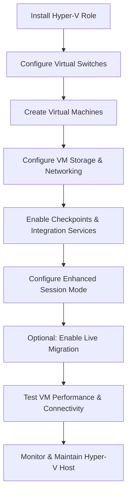

# Enterprise Windows Server Administration Knowledge Base  
## 06 — Hyper‑V Configuration (Windows Server 2019)

---

## Overview

Hyper‑V is Microsoft’s enterprise virtualization platform included with Windows Server 2019. It enables administrators to create and manage virtual machines (VMs), virtual networks, storage, checkpoints, and high‑availability workloads. Proper Hyper‑V configuration ensures efficient resource utilization, secure isolation, and scalable deployment of virtualized infrastructure.

This document covers:
- Hyper‑V concepts  
- Installing Hyper‑V  
- Virtual switch configuration  
- VM creation  
- VM storage configuration  
- Checkpoints  
- Hyper‑V Manager & PowerShell  
- Enhanced session mode  
- Nested virtualization  
- Live migration (optional)  
- Troubleshooting  
- Best practices  

---

## 🧩 Workflow Diagram — Hyper‑V Deployment Lifecycle



---

# 1. Hyper‑V Concepts

Hyper‑V provides:
- Virtual machines (VMs)  
- Virtual switches  
- Virtual hard disks (VHD/VHDX)  
- Checkpoints  
- Resource allocation (CPU, RAM, storage)  
- Isolation and security  

Key components:
- Hyper‑V Host  
- Hyper‑V Manager  
- VM Worker Process (vmwp.exe)  
- Virtual Switch Manager  
- Integration Services  

---

# 2. Install Hyper‑V Role

## GUI Method

```
Server Manager → Manage → Add Roles and Features
→ Hyper-V → Include Management Tools
```

## PowerShell Method

```powershell
Install-WindowsFeature -Name Hyper-V -IncludeManagementTools -Restart
```

Verify installation:

```powershell
Get-WindowsFeature Hyper-V
```

---

# 3. Configure Virtual Switches

Hyper‑V supports three switch types:

| Switch Type | Description |
|-------------|-------------|
| External | Connects VMs to physical network |
| Internal | VMs communicate with host only |
| Private | VMs communicate with each other only |

## Create External Switch (recommended)

### GUI

```
Hyper-V Manager → Virtual Switch Manager → New External Switch
```

### PowerShell

```powershell
New-VMSwitch -Name "ExternalSwitch" -NetAdapterName "Ethernet" -AllowManagementOS $true
```

---

# 4. Create Virtual Machines

## GUI Method

```
Hyper-V Manager → New → Virtual Machine
```

Configure:
- Name  
- Generation (Gen 1 or Gen 2)  
- Memory (Dynamic recommended)  
- Networking  
- Virtual disk  
- OS installation media  

## PowerShell Method

```powershell
New-VM -Name "SRV-APP01" -MemoryStartupBytes 4GB -Generation 2 -SwitchName "ExternalSwitch"
```

---

# 5. Configure VM Storage

### Create VHDX Disk

```powershell
New-VHD -Path "D:\VMs\SRV-APP01\disk1.vhdx" -SizeBytes 60GB -Dynamic
```

### Attach Disk to VM

```powershell
Add-VMHardDiskDrive -VMName "SRV-APP01" -Path "D:\VMs\SRV-APP01\disk1.vhdx"
```

---

# 6. Configure VM Networking

### Assign Network Adapter

```powershell
Add-VMNetworkAdapter -VMName "SRV-APP01" -SwitchName "ExternalSwitch"
```

### Set MAC Address (optional)

```powershell
Set-VMNetworkAdapter -VMName "SRV-APP01" -StaticMacAddress "00-15-5D-00-01-01"
```

---

# 7. Checkpoints (Snapshots)

Checkpoints allow rollback to a previous VM state.

### Enable Checkpoints

```powershell
Set-VM -Name "SRV-APP01" -CheckpointType Standard
```

### Create Checkpoint

```powershell
Checkpoint-VM -Name "SRV-APP01"
```

### Apply Checkpoint

```powershell
Restore-VMCheckpoint -VMName "SRV-APP01" -Name "Checkpoint1"
```

---

# 8. Enhanced Session Mode

Provides:
- Clipboard sharing  
- USB redirection  
- Display resizing  

### Enable on Host

```powershell
Set-VMHost -EnableEnhancedSessionMode $true
```

### Enable on VM

```powershell
Set-VM -Name "SRV-APP01" -EnhancedSessionTransportType HvSocket
```

---

# 9. Nested Virtualization (Optional)

Allows running Hyper‑V inside a VM.

### Enable Nested Virtualization

```powershell
Set-VMProcessor -VMName "SRV-HYP01" -ExposeVirtualizationExtensions $true
```

---

# 10. Live Migration (Optional)

Live migration moves running VMs between hosts.

### Enable Live Migration

```powershell
Set-VMHost -VirtualMachineMigrationEnabled $true
```

### Configure Authentication

```powershell
Set-VMHost -VirtualMachineMigrationAuthenticationType CredSSP
```

---

# 11. Testing & Verification

### Check VM status

```powershell
Get-VM
```

### Check virtual switch

```powershell
Get-VMSwitch
```

### Test VM network connectivity

```powershell
Test-Connection SRV-APP01
```

### Check Hyper‑V health

```powershell
Get-VMHost
```

---

# 12. Troubleshooting

| Issue | Cause | Fix |
|-------|-------|-----|
| VM cannot connect to network | Wrong switch type | Use External switch |
| VM slow performance | Dynamic memory misconfigured | Adjust memory settings |
| Checkpoints fail | VSS issues | Restart VSS services |
| VM won’t start | Insufficient resources | Increase CPU/RAM |
| Nested virtualization fails | CPU not supported | Check virtualization extensions |

---

# 13. Best Practices

- Use Gen 2 VMs for modern OS  
- Use dynamic memory for efficiency  
- Store VMs on dedicated SSD/NVMe  
- Use External switches for production  
- Enable checkpoints for testing only  
- Disable SMBv1 on Hyper‑V hosts  
- Document VM configurations  
- Monitor Hyper‑V performance regularly  
- Backup VMs and host configuration  

---

# References

- Microsoft Learn — Hyper‑V  
- Microsoft Learn — Virtual Machine Management  
- Microsoft Learn — Hyper‑V Networking  
```
