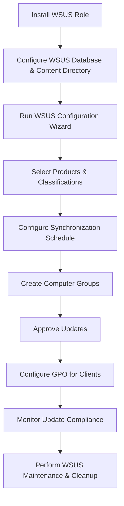

# Enterprise Windows Server Administration Knowledge Base  
## 07 — WSUS Deployment (Windows Server 2019)

---

## Overview

Windows Server Update Services (WSUS) enables centralized management of Microsoft product updates across enterprise environments. WSUS allows administrators to approve, decline, schedule, and report on updates for Windows clients and servers, reducing bandwidth usage and ensuring consistent patch compliance.

This document covers:
- WSUS concepts  
- Installing WSUS  
- Database options  
- WSUS role configuration  
- Synchronization settings  
- Products & classifications  
- Computer groups  
- Update approvals  
- GPO configuration  
- Maintenance & cleanup  
- Troubleshooting  
- Best practices  

---

## 🧩 Workflow Diagram — WSUS Deployment Lifecycle



---

# 1. WSUS Concepts

WSUS provides:
- Centralized update distribution  
- Update approval workflow  
- Reporting and compliance tracking  
- Bandwidth optimization  
- Integration with Group Policy  

Key components:
- WSUS Server  
- WSUS Database (WID or SQL)  
- Update content directory  
- Synchronization source (Microsoft Update or upstream WSUS)  
- Computer groups  

---

# 2. Install WSUS Role

## GUI Method

```
Server Manager → Manage → Add Roles and Features
→ Windows Server Update Services
```

Select:
- WSUS Services  
- Database  
- WSUS Console  

## PowerShell Method

```powershell
Install-WindowsFeature -Name UpdateServices, UpdateServices-RSAT -IncludeManagementTools
```

---

# 3. WSUS Database Options

WSUS supports two database types:

### 1. Windows Internal Database (WID)
- Default option  
- Suitable for small/medium environments  
- No external SQL licensing required  

### 2. SQL Server
- Recommended for large enterprises  
- Supports remote management  
- Better performance  

---

# 4. Configure WSUS Content Directory

WSUS stores update files locally.

Recommended:
- Dedicated volume (e.g., `D:\WSUS`)  
- Minimum 100 GB free space  

### PowerShell

```powershell
Set-WsusServerSynchronization -SyncFromMicrosoftUpdate
```

---

# 5. Run WSUS Configuration Wizard

Launch:

```
Server Manager → Tools → Windows Server Update Services
```

Configure:
- Upstream server (Microsoft Update or internal WSUS)  
- Proxy (optional)  
- Products  
- Classifications  
- Sync schedule  

---

# 6. Select Products & Classifications

### Recommended Products
- Windows 10 / 11  
- Windows Server 2016 / 2019 / 2022  
- Microsoft Office  
- .NET Framework  

### Recommended Classifications
- Critical Updates  
- Security Updates  
- Definition Updates  
- Feature Packs  
- Service Packs  

Avoid selecting unnecessary products to reduce storage usage.

---

# 7. Configure Synchronization Schedule

### GUI

```
WSUS Console → Options → Synchronization Schedule
```

### PowerShell

```powershell
Set-WsusServerSynchronization -SyncTimeOfDay 03:00
```

Run initial sync:

```powershell
Invoke-WsusServerSynchronization
```

---

# 8. Create Computer Groups

Recommended structure:

```
WSUS
 ├── Servers
 ├── Workstations
 ├── Pilot
 └── Critical Systems
```

### PowerShell

```powershell
Add-WsusComputerTargetGroup -Name "Servers"
Add-WsusComputerTargetGroup -Name "Workstations"
Add-WsusComputerTargetGroup -Name "Pilot"
```

---

# 9. Approve Updates

### GUI

```
WSUS Console → Updates → All Updates → Approve
```

### PowerShell

Approve all security updates for Servers:

```powershell
Get-WsusUpdate -Classification SecurityUpdates | Approve-WsusUpdate -Action Install -TargetGroupName "Servers"
```

---

# 10. Configure Group Policy for Clients

### GPO Path

```
Computer Configuration → Policies → Administrative Templates
→ Windows Components → Windows Update
```

### Required Settings

| Setting | Value |
|---------|--------|
| Specify intranet Microsoft update service location | `http://SRV-WSUS01:8530` |
| Configure Automatic Updates | Enabled |
| Automatic Updates detection frequency | 4 hours |
| Allow signed updates from intranet Microsoft update service location | Enabled |

### PowerShell to create GPO

```powershell
New-GPO -Name "WSUS-Client-Policy"
```

---

# 11. WSUS Maintenance & Cleanup

WSUS requires regular maintenance.

### Cleanup Wizard

```
WSUS Console → Options → Server Cleanup Wizard
```

### PowerShell Cleanup

```powershell
Invoke-WsusServerCleanup -CleanupObsoleteUpdates -CleanupObsoleteComputers -CompressUpdates -DeclineExpiredUpdates
```

### Reindex WSUS Database (WID)

```powershell
& "$env:ProgramFiles\Update Services\Tools\WsusDBMaintenance.ps1"
```

---

# 12. Testing & Verification

### Check client WSUS configuration

```powershell
gpresult /r
```

### Force client update detection

```powershell
wuauclt /detectnow
wuauclt /reportnow
```

### Check WSUS health

```powershell
Get-WsusServer
Get-WsusUpdate
```

---

# 13. Troubleshooting

| Issue | Cause | Fix |
|-------|-------|-----|
| Clients not reporting | GPO misconfigured | Verify WSUS URL |
| WSUS slow performance | Database fragmentation | Run maintenance |
| Updates not downloading | Proxy or firewall | Allow WSUS outbound |
| High disk usage | Too many products | Reduce product selection |
| Sync failures | Upstream unreachable | Check internet or upstream WSUS |

---

# 14. Best Practices

- Use dedicated WSUS server  
- Select only required products  
- Create pilot group for testing updates  
- Schedule sync during off‑peak hours  
- Perform monthly WSUS cleanup  
- Document approval workflow  
- Monitor update compliance  
- Backup WSUS database regularly  

---

# References

- Microsoft Learn — WSUS  
- Microsoft Learn — Windows Update for Business  
- Microsoft Learn — WSUS Maintenance  
```
