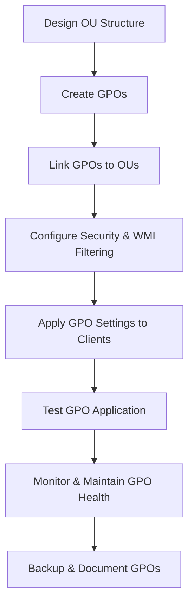

# Enterprise Windows Server Administration Knowledge Base  
## 08 — Group Policy Management (Windows Server 2019)

---

## Overview

Group Policy is the primary mechanism for managing configuration, security, and behavior of Windows clients and servers in an Active Directory environment. Proper Group Policy design ensures consistent configuration, secure baselines, automated enforcement, and centralized management across the enterprise.

This document covers:
- Group Policy concepts  
- Installing GPMC  
- GPO design principles  
- OU structure alignment  
- Creating & linking GPOs  
- Security filtering  
- WMI filtering  
- GPO inheritance & precedence  
- GPO backup & restore  
- Troubleshooting  
- Best practices  

---

## 🧩 Workflow Diagram — Group Policy Deployment Lifecycle



---

# 1. Group Policy Concepts

Group Policy provides:
- Centralized configuration management  
- Security enforcement  
- Software deployment  
- Script automation  
- Registry-based configuration  

Key components:
- Group Policy Objects (GPOs)  
- Group Policy Management Console (GPMC)  
- Organizational Units (OUs)  
- Security filtering  
- WMI filtering  
- GPO inheritance  

---

# 2. Install Group Policy Management Console (GPMC)

## GUI Method

```
Server Manager → Add Roles and Features
→ Group Policy Management
```

## PowerShell Method

```powershell
Install-WindowsFeature GPMC
```

Launch GPMC:

```
Server Manager → Tools → Group Policy Management
```

---

# 3. OU Structure Design

A clean OU structure is essential for effective GPO targeting.

### Recommended OU Structure

```
corp.local
 ├── Corp Users
 ├── Corp Computers
 │     ├── Workstations
 │     └── Servers
 ├── Service Accounts
 └── Groups
```

### Avoid:
- Linking GPOs at the domain root  
- Mixing users and computers in the same OU  
- Deeply nested OU structures  

---

# 4. Creating Group Policy Objects (GPOs)

## GUI Method

```
GPMC → Group Policy Objects → New
```

## PowerShell Method

```powershell
New-GPO -Name "Corp-Workstation-Policy"
```

---

# 5. Linking GPOs to OUs

## GUI Method

```
GPMC → OU → Link an Existing GPO
```

## PowerShell Method

```powershell
New-GPLink -Name "Corp-Workstation-Policy" -Target "OU=Workstations,DC=corp,DC=local"
```

---

# 6. Security Filtering

Security filtering restricts GPO application to specific groups.

### Example

Apply workstation policy only to workstation group:

```
GPMC → GPO → Scope → Security Filtering → Add "Corp-Workstation-Users"
```

### PowerShell

```powershell
Set-GPPermissions -Name "Corp-Workstation-Policy" -PermissionLevel GpoApply -TargetName "Corp-Workstation-Users"
```

---

# 7. WMI Filtering

WMI filters allow targeting based on OS, hardware, or configuration.

### Example: Apply GPO only to Windows 10

```text
SELECT * FROM Win32_OperatingSystem WHERE Version LIKE "10.%"
```

### PowerShell

```powershell
New-GPWmiFilter -Name "Windows10Filter" -Query 'SELECT * FROM Win32_OperatingSystem WHERE Version LIKE "10.%"'
```

Link filter:

```powershell
Set-GPWmiFilter -Name "Corp-Workstation-Policy" -WmiFilter "Windows10Filter"
```

---

# 8. Common GPO Configurations

### Security Settings
- Password policies  
- Account lockout  
- User rights assignment  
- Audit policies  

### Computer Configuration
- Windows Update settings  
- Firewall rules  
- Software installation  
- Drive mappings  
- Scripts  

### User Configuration
- Desktop restrictions  
- Start menu layout  
- Folder redirection  
- Login scripts  

---

# 9. GPO Inheritance & Precedence

### Processing Order
1. Local GPO  
2. Site  
3. Domain  
4. OU (top → bottom)

### Enforced GPO
Overrides inheritance blocking.

### Block Inheritance
Prevents higher-level GPOs from applying.

---

# 10. GPO Backup & Restore

### Backup GPO

```powershell
Backup-GPO -Name "Corp-Workstation-Policy" -Path "D:\GPOBackup"
```

### Restore GPO

```powershell
Restore-GPO -Name "Corp-Workstation-Policy" -Path "D:\GPOBackup"
```

---

# 11. Testing & Verification

### Force GPO update

```powershell
gpupdate /force
```

### Check applied GPOs

```powershell
gpresult /r
gpresult /h report.html
```

### Validate GPO health

```powershell
dcdiag /test:sysvolcheck
```

---

# 12. Troubleshooting

| Issue | Cause | Fix |
|-------|-------|-----|
| GPO not applying | Wrong OU | Move object to correct OU |
| Incorrect settings | Conflicting GPOs | Review precedence |
| Slow login | Excessive GPOs | Consolidate GPOs |
| WMI filter failure | Incorrect query | Validate WMI query |
| SYSVOL replication issues | DFSR error | Check DFSR health |

---

# 13. Best Practices

- Use OU-based targeting  
- Avoid linking GPOs at domain root  
- Use security groups for filtering  
- Use WMI filters sparingly  
- Document all GPOs  
- Backup GPOs regularly  
- Test GPOs in pilot OU  
- Keep GPOs small and modular  
- Monitor SYSVOL replication  

---

# References

- Microsoft Learn — Group Policy  
- Microsoft Learn — GPMC  
- Microsoft Learn — WMI Filters  
```
