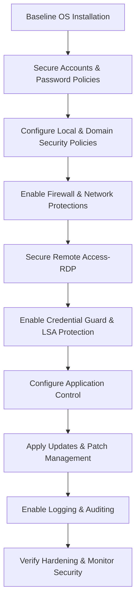

# Enterprise Windows Server Administration Knowledge Base  
## 09 — Server Security Hardening (Windows Server 2019)

---

## Overview

Server security hardening is essential for protecting enterprise infrastructure against unauthorized access, malware, privilege escalation, and lateral movement. Windows Server 2019 includes numerous built‑in security features that, when properly configured, significantly reduce attack surface and improve overall resilience.

This document covers:
- Hardening principles  
- Account security  
- Local policies  
- Network security  
- Firewall configuration  
- Secure RDP  
- Credential protection  
- Application control  
- Patch management  
- Logging & auditing  
- Verification  
- Troubleshooting  
- Best practices  

---

## 🧩 Workflow Diagram — Server Hardening Lifecycle



---

# 1. Hardening Principles

Security hardening follows these core principles:

- **Least privilege**  
- **Defense in depth**  
- **Secure by default**  
- **Reduce attack surface**  
- **Continuous monitoring**  

---

# 2. Account Security

## 2.1 Rename Administrator Account (optional)

```powershell
Rename-LocalUser -Name "Administrator" -NewName "LocalAdmin"
```

## 2.2 Enforce Strong Password Policies

### GPO Path

```
Computer Configuration → Policies → Windows Settings → Security Settings → Account Policies → Password Policy
```

Recommended:
- Minimum length: 12+  
- Complexity: Enabled  
- Maximum age: 60 days  

## 2.3 Disable Guest Account

```powershell
Disable-LocalUser -Name "Guest"
```

---

# 3. Local Security Policies

### GPO Path

```
Computer Configuration → Policies → Windows Settings → Security Settings → Local Policies
```

Key policies:
- Audit Policy  
- User Rights Assignment  
- Security Options  

### Example: Disable anonymous SID enumeration

```powershell
Set-ItemProperty "HKLM:\SYSTEM\CurrentControlSet\Control\Lsa" -Name "RestrictAnonymous" -Value 1
```

---

# 4. Network Security

## 4.1 Disable Unused Network Protocols

```powershell
Disable-NetAdapterBinding -Name "Ethernet" -ComponentID ms_tcpip6
```

## 4.2 Disable SMBv1

```powershell
Disable-WindowsOptionalFeature -Online -FeatureName SMB1Protocol
```

## 4.3 Enable SMB Signing

```powershell
Set-SmbServerConfiguration -EnableSecuritySignature $true
```

---

# 5. Windows Firewall Configuration

### View firewall profiles

```powershell
Get-NetFirewallProfile
```

### Enable firewall for all profiles

```powershell
Set-NetFirewallProfile -Profile Domain,Public,Private -Enabled True
```

### Allow only required inbound rules

Example: Allow RDP

```powershell
Enable-NetFirewallRule -DisplayGroup "Remote Desktop"
```

---

# 6. Secure Remote Desktop (RDP)

## 6.1 Enable Network Level Authentication (NLA)

```powershell
Set-ItemProperty -Path 'HKLM:\System\CurrentControlSet\Control\Terminal Server\WinStations\RDP-Tcp' -Name 'UserAuthentication' -Value 1
```

## 6.2 Restrict RDP Access to Admins

### GPO Path

```
Computer Configuration → Policies → Windows Settings → Security Settings → Restricted Groups
```

Add:
- Domain Admins  
- Server Admins  

## 6.3 Change RDP Port (optional)

```powershell
Set-ItemProperty -Path 'HKLM:\System\CurrentControlSet\Control\Terminal Server\WinStations\RDP-Tcp' -Name 'PortNumber' -Value 3390
```

---

# 7. Credential Protection

## 7.1 Enable Credential Guard

```powershell
Set-ItemProperty -Path "HKLM:\SYSTEM\CurrentControlSet\Control\DeviceGuard" -Name "EnableVirtualizationBasedSecurity" -Value 1
```

## 7.2 Enable LSA Protection

```powershell
Set-ItemProperty -Path "HKLM:\SYSTEM\CurrentControlSet\Control\Lsa" -Name "RunAsPPL" -Value 1
```

---

# 8. Application Control

## 8.1 Enable AppLocker

### Install AppLocker

```powershell
Install-WindowsFeature AppLocker
```

### Create default rules

```powershell
New-AppLockerPolicy -DefaultRule -XMLPolicy "C:\AppLockerDefault.xml"
Set-AppLockerPolicy -XMLPolicy "C:\AppLockerDefault.xml"
```

## 8.2 Enable Windows Defender Exploit Guard

### Attack Surface Reduction (ASR)

```powershell
Set-MpPreference -AttackSurfaceReductionRules_Ids 56a863a9-875e-4185-98a7-b882c64b5ce5 -AttackSurfaceReductionRules_Actions Enabled
```

---

# 9. Patch Management

## 9.1 Install updates

```powershell
Install-WindowsUpdate -AcceptAll -AutoReboot
```

## 9.2 WSUS Integration

Configure via GPO:

```
Computer Configuration → Policies → Administrative Templates → Windows Update
```

---

# 10. Logging & Auditing

## 10.1 Enable Audit Policies

### GPO Path

```
Computer Configuration → Policies → Windows Settings → Security Settings → Advanced Audit Policy Configuration
```

Recommended:
- Logon events  
- Object access  
- Policy changes  
- Privilege use  
- System events  

## 10.2 Enable PowerShell Logging

```powershell
Set-ItemProperty "HKLM:\Software\Policies\Microsoft\Windows\PowerShell\ScriptBlockLogging" -Name "EnableScriptBlockLogging" -Value 1
```

---

# 11. Verification

### Check firewall status

```powershell
Get-NetFirewallProfile
```

### Check Credential Guard

```powershell
Get-CimInstance -ClassName Win32_DeviceGuard
```

### Check AppLocker enforcement

```powershell
Get-AppLockerPolicy -Effective -XML
```

### Check audit logs

```
Event Viewer → Security Logs
```

---

# 12. Troubleshooting

| Issue | Cause | Fix |
|-------|-------|-----|
| RDP blocked | Firewall misconfigured | Enable RDP rules |
| AppLocker blocking apps | Incorrect rules | Review AppLocker policy |
| Credential Guard fails | Virtualization disabled | Enable VT‑x/AMD‑V |
| Slow performance | Excessive logging | Adjust audit policy |
| SMB issues | SMBv1 disabled | Use SMBv2/3 |

---

# 13. Best Practices

- Enforce least privilege  
- Disable unused services  
- Use secure RDP configuration  
- Enable Credential Guard & LSA protection  
- Use AppLocker for application control  
- Apply updates regularly  
- Monitor event logs  
- Document all hardening steps  
- Perform regular security audits  

---

# References

- Microsoft Learn — Security Hardening  
- Microsoft Learn — Credential Guard  
- Microsoft Learn — AppLocker  
- Microsoft Learn — Windows Firewall  
```

