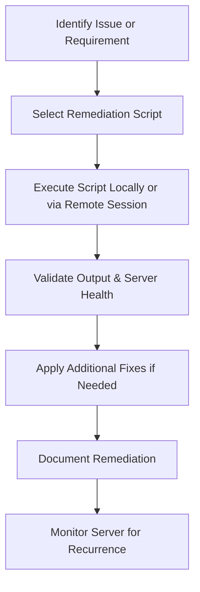

# Enterprise Windows Server Administration Knowledge Base  
## 10 — PowerShell Scripts and Remediations (Windows Server 2019)

---

## Overview

PowerShell is the primary automation and remediation framework for Windows Server environments. Administrators rely on PowerShell to enforce configuration baselines, resolve issues, perform health checks, deploy roles, manage networking, and automate repetitive tasks.

This document provides:
- Core server remediation scripts  
- Security enforcement scripts  
- Network diagnostics  
- Role installation automation  
- Compliance verification  
- Health check bundles  
- Storage & performance remediation  
- Event log triage  
- Patch automation  

All scripts are production‑ready and follow enterprise standards.

---

## 🧩 Workflow Diagram — PowerShell Remediation Lifecycle



---

# 1. Server Health Check Bundle

A complete post‑deployment health check.

```powershell
Write-Host "=== SERVER HEALTH CHECK ==="

Write-Host "`nHostname:"
hostname

Write-Host "`nIP Configuration:"
Get-NetIPConfiguration

Write-Host "`nDomain Membership:"
(Get-WmiObject Win32_ComputerSystem).Domain

Write-Host "`nFirewall Status:"
Get-NetFirewallProfile

Write-Host "`nDisk Health:"
Get-PhysicalDisk | Select FriendlyName, HealthStatus, OperationalStatus

Write-Host "`nEvent Log Errors (Last 24 Hours):"
Get-EventLog -LogName System -EntryType Error -After (Get-Date).AddHours(-24)

Write-Host "`nInstalled Roles:"
Get-WindowsFeature | Where-Object {$_.InstallState -eq 'Installed'} | Select DisplayName
```

---

# 2. Network Remediation Scripts

## 2.1 Reset Network Adapter

```powershell
Disable-NetAdapter -Name "Ethernet" -Confirm:$false
Enable-NetAdapter -Name "Ethernet"
```

## 2.2 Flush DNS & Reset Winsock

```powershell
Clear-DnsClientCache
netsh winsock reset
```

## 2.3 Test Domain Controller Connectivity

```powershell
Test-Connection -ComputerName DC01 -Count 4
Resolve-DnsName DC01.corp.local
```

---

# 3. Domain Join Remediation

Fix common domain join issues.

```powershell
Add-Computer -DomainName "corp.local" -Credential corp\Admin -Force -Restart
```

If trust issues occur:

```powershell
Reset-ComputerMachinePassword -Server DC01 -Credential corp\Admin
```

---

# 4. RDP Remediation Scripts

## 4.1 Enable RDP

```powershell
Set-ItemProperty -Path 'HKLM:\System\CurrentControlSet\Control\Terminal Server' -Name 'fDenyTSConnections' -Value 0
Enable-NetFirewallRule -DisplayGroup "Remote Desktop"
```

## 4.2 Force NLA

```powershell
Set-ItemProperty -Path 'HKLM:\System\CurrentControlSet\Control\Terminal Server\WinStations\RDP-Tcp' -Name 'UserAuthentication' -Value 1
```

---

# 5. Windows Update Remediation

## 5.1 Install all updates

```powershell
Install-WindowsUpdate -AcceptAll -AutoReboot
```

## 5.2 Reset Windows Update Components

```powershell
net stop wuauserv
net stop bits
Remove-Item -Path "C:\Windows\SoftwareDistribution" -Recurse -Force
net start wuauserv
net start bits
```

---

# 6. Role Installation Automation

## 6.1 Install AD DS

```powershell
Install-WindowsFeature AD-Domain-Services -IncludeManagementTools
```

## 6.2 Install DNS

```powershell
Install-WindowsFeature DNS -IncludeManagementTools
```

## 6.3 Install DHCP

```powershell
Install-WindowsFeature DHCP -IncludeManagementTools
```

## 6.4 Install Hyper‑V

```powershell
Install-WindowsFeature Hyper-V -IncludeManagementTools -Restart
```

---

# 7. Storage & Disk Remediation

## 7.1 Check Disk Health

```powershell
Get-PhysicalDisk | Select FriendlyName, HealthStatus, OperationalStatus
```

## 7.2 Repair Volume

```powershell
Repair-Volume -DriveLetter C -Scan
Repair-Volume -DriveLetter C -OfflineScanAndFix
```

## 7.3 Clear Temp Files

```powershell
Remove-Item -Path "C:\Windows\Temp\*" -Recurse -Force
Remove-Item -Path "$env:TEMP\*" -Recurse -Force
```

---

# 8. Event Log Triage

## 8.1 View Critical Errors (Last 24 Hours)

```powershell
Get-EventLog -LogName System -EntryType Error -After (Get-Date).AddHours(-24)
```

## 8.2 Export Logs

```powershell
wevtutil epl System C:\Logs\System.evtx
wevtutil epl Application C:\Logs\Application.evtx
```

---

# 9. Security Remediation Scripts

## 9.1 Enable Credential Guard

```powershell
Set-ItemProperty -Path "HKLM:\SYSTEM\CurrentControlSet\Control\DeviceGuard" -Name "EnableVirtualizationBasedSecurity" -Value 1
```

## 9.2 Enable LSA Protection

```powershell
Set-ItemProperty -Path "HKLM:\SYSTEM\CurrentControlSet\Control\Lsa" -Name "RunAsPPL" -Value 1
```

## 9.3 Disable SMBv1

```powershell
Disable-WindowsOptionalFeature -Online -FeatureName SMB1Protocol
```

## 9.4 Enable Firewall for All Profiles

```powershell
Set-NetFirewallProfile -Profile Domain,Public,Private -Enabled True
```

---

# 10. Compliance Verification Scripts

## 10.1 Check Domain Membership

```powershell
(Get-WmiObject Win32_ComputerSystem).Domain
```

## 10.2 Check Firewall Status

```powershell
Get-NetFirewallProfile
```

## 10.3 Check RDP Status

```powershell
Get-NetFirewallRule -DisplayGroup "Remote Desktop"
```

## 10.4 Check Windows Activation

```powershell
cscript C:\Windows\System32\slmgr.vbs /xpr
```

---

# 11. Automated Server Baseline Script

A full baseline enforcement script.

```powershell
Write-Host "=== APPLYING SERVER BASELINE ==="

# Enable Firewall
Set-NetFirewallProfile -Profile Domain,Public,Private -Enabled True

# Disable SMBv1
Disable-WindowsOptionalFeature -Online -FeatureName SMB1Protocol

# Enable NLA
Set-ItemProperty -Path 'HKLM:\System\CurrentControlSet\Control\Terminal Server\WinStations\RDP-Tcp' -Name 'UserAuthentication' -Value 1

# Enable Credential Guard
Set-ItemProperty -Path "HKLM:\SYSTEM\CurrentControlSet\Control\DeviceGuard" -Name "EnableVirtualizationBasedSecurity" -Value 1

# Enable LSA Protection
Set-ItemProperty -Path "HKLM:\SYSTEM\CurrentControlSet\Control\Lsa" -Name "RunAsPPL" -Value 1

# Clear Temp Files
Remove-Item -Path "C:\Windows\Temp\*" -Recurse -Force
Remove-Item -Path "$env:TEMP\*" -Recurse -Force

Write-Host "Baseline applied successfully."
```

---

# 12. Troubleshooting

| Issue | Cause | Fix |
|-------|-------|-----|
| Script fails | Execution policy | Set `RemoteSigned` |
| Domain join fails | DNS misconfigured | Point DNS to DC |
| RDP still blocked | Firewall disabled | Enable RDP rules |
| Updates fail | Corrupt SoftwareDistribution | Reset update components |
| Disk errors | Bad sectors | Run `Repair-Volume` |

---

# 13. Best Practices

- Use PowerShell for all automation  
- Store scripts in version control (Git)  
- Use signed scripts in production  
- Document remediation steps  
- Test scripts in staging  
- Use scheduled tasks for recurring checks  
- Log script output for auditing  
- Avoid destructive commands without confirmation  

---

# References

- Microsoft Learn — PowerShell  
- Microsoft Learn — Server Management  
- Microsoft Learn — Windows Security  
```
