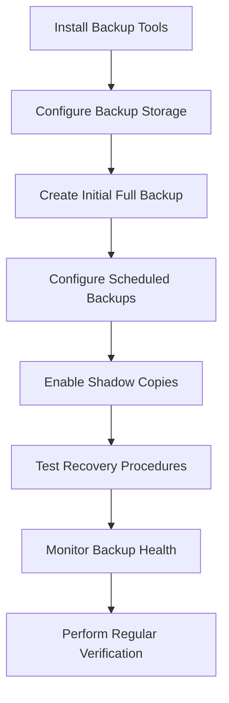

# Enterprise Windows Server Administration Knowledge Base  
## 11 — Server Backup and Recovery (Windows Server 2019)

---

## Overview

Backup and recovery are critical components of enterprise server administration. Windows Server 2019 includes built‑in tools such as Windows Server Backup (WSB), Volume Shadow Copy Service (VSS), and System Image Backup. Proper backup configuration ensures business continuity, rapid disaster recovery, and protection against data loss.

This document covers:
- Backup concepts  
- Installing Windows Server Backup  
- Full server backup  
- System state backup  
- Bare‑metal recovery  
- Scheduled backups  
- Shadow copies  
- Recovery procedures  
- Verification  
- Troubleshooting  
- Best practices  

---

## 🧩 Workflow Diagram — Backup & Recovery Lifecycle



---

# 1. Backup Concepts

Windows Server backup supports:
- **Full server backup**  
- **System state backup**  
- **Bare‑metal recovery**  
- **Volume-level backup**  
- **File-level backup**  
- **Shadow copies**  

Key components:
- Windows Server Backup (WSB)  
- Volume Shadow Copy Service (VSS)  
- Recovery environment (WinRE)  
- Backup target (disk, network share, external storage)  

---

# 2. Install Windows Server Backup

## GUI Method

```
Server Manager → Add Roles and Features
→ Windows Server Backup
```

## PowerShell Method

```powershell
Install-WindowsFeature Windows-Server-Backup
```

Launch:

```
Server Manager → Tools → Windows Server Backup
```

---

# 3. Configure Backup Storage

Recommended backup targets:
- Dedicated backup disk  
- External USB disk  
- Network share (NAS)  
- SAN storage  

### Format backup disk

```powershell
Initialize-Disk -Number 2
New-Partition -DiskNumber 2 -UseMaximumSize -AssignDriveLetter
Format-Volume -DriveLetter E -FileSystem NTFS -NewFileSystemLabel "BackupDisk"
```

---

# 4. Full Server Backup

## GUI Method

```
Windows Server Backup → Local Backup → Backup Once → Full Server
```

## PowerShell Method

```powershell
wbadmin start backup -backupTarget:E: -include:C: -allCritical -quiet
```

### Explanation
- `-allCritical` includes system state and boot files  
- `-quiet` suppresses prompts  

---

# 5. System State Backup

System state includes:
- AD DS  
- Registry  
- Boot files  
- COM+  
- SYSVOL  
- Certificates  

### PowerShell

```powershell
wbadmin start systemstatebackup -backupTarget:E: -quiet
```

---

# 6. Bare‑Metal Recovery Backup

Bare‑metal recovery restores the entire server.

### PowerShell

```powershell
wbadmin start backup -backupTarget:E: -allCritical -quiet
```

---

# 7. Scheduled Backups

## GUI Method

```
Windows Server Backup → Local Backup → Backup Schedule
```

## PowerShell Method

Daily backup at 2 AM:

```powershell
wbadmin enable backup -addtarget:E: -schedule:02:00 -include:C: -allCritical -quiet
```

---

# 8. Shadow Copies (Volume Snapshot)

Shadow copies allow quick restore of files.

## Enable Shadow Copies

### GUI

```
Volume Properties → Shadow Copies → Enable
```

### PowerShell

```powershell
vssadmin add shadowstorage /for=C: /on=D: /maxsize=20GB
```

## Create Snapshot

```powershell
vssadmin create shadow /for=C:
```

---

# 9. Recovery Procedures

## 9.1 Recover Files

```powershell
wbadmin get versions
wbadmin start recovery -version:<ID> -itemType:File -items:C:\Data -backupTarget:E:
```

## 9.2 Recover System State

```powershell
wbadmin start systemstaterecovery -version:<ID> -quiet
```

## 9.3 Bare‑Metal Recovery

Steps:
1. Boot from Windows Server media  
2. Select **Repair your computer**  
3. Choose **System Image Recovery**  
4. Select backup target  
5. Restore full server  

---

# 10. Backup Verification

### Check backup history

```powershell
wbadmin get versions
```

### Check last backup status

```powershell
Get-WinEvent -LogName Microsoft-Windows-Backup
```

### Test restore (recommended quarterly)

Perform:
- File restore  
- System state restore (lab environment)  

---

# 11. Troubleshooting

| Issue | Cause | Fix |
|-------|-------|-----|
| Backup fails | VSS errors | Restart VSS services |
| Disk full | Insufficient space | Increase backup disk |
| Network backup slow | Bandwidth limits | Use dedicated NIC |
| System state backup fails | AD DS corruption | Run `dcdiag` |
| Bare‑metal recovery fails | Wrong image | Select correct version |

### Restart VSS Services

```powershell
net stop vss
net start vss
```

---

# 12. Best Practices

- Use dedicated backup storage  
- Store backups offsite or in cloud  
- Enable shadow copies for shared folders  
- Perform full backup weekly  
- Perform system state backup daily on domain controllers  
- Test recovery procedures regularly  
- Encrypt backup disks  
- Document backup schedules  
- Monitor backup logs daily  

---

# References

- Microsoft Learn — Windows Server Backup  
- Microsoft Learn — VSS  
- Microsoft Learn — Disaster Recovery  


### **12‑Windows‑Server‑Monitoring‑and‑Performance.md**

and continue building your Windows Server Knowledge Base.
