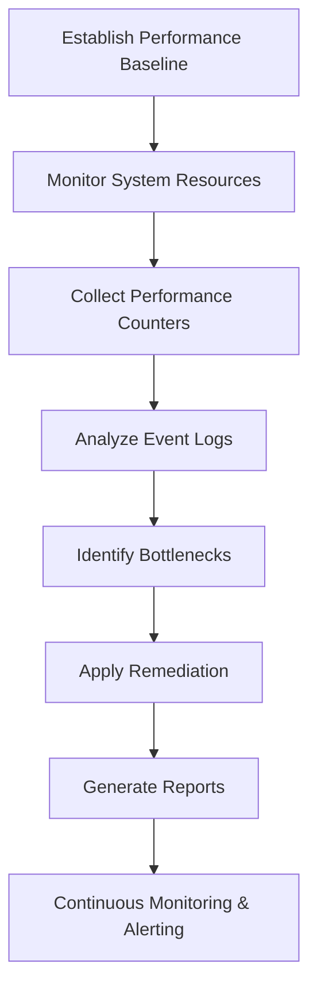

# Enterprise Windows Server Administration Knowledge Base  
## 12 — Windows Server Monitoring and Performance (Windows Server 2019)

---

## Overview

Monitoring and performance management are essential for maintaining a stable, secure, and efficient Windows Server environment. Windows Server 2019 provides built‑in tools such as Performance Monitor, Resource Monitor, Event Viewer, Task Manager, and PowerShell cmdlets to track system health, diagnose bottlenecks, and optimize workloads.

This document covers:
- Monitoring concepts  
- Core monitoring tools  
- Performance counters  
- CPU, memory, disk, and network analysis  
- Event log monitoring  
- PowerShell monitoring scripts  
- Performance baselines  
- Alerting and reporting  
- Troubleshooting  
- Best practices  

---

## 🧩 Workflow Diagram — Server Monitoring Lifecycle



---

# 1. Monitoring Concepts

Monitoring ensures:
- Early detection of issues  
- Performance optimization  
- Capacity planning  
- Security event detection  
- Compliance reporting  

Key areas:
- CPU utilization  
- Memory usage  
- Disk I/O  
- Network throughput  
- Event logs  
- Application performance  

---

# 2. Core Monitoring Tools

## 2.1 Task Manager
Quick overview of:
- CPU  
- Memory  
- Disk  
- Network  
- Running processes  

## 2.2 Resource Monitor
Detailed view of:
- Disk activity  
- Network connections  
- Memory usage  
- CPU threads  

Launch:

```powershell
resmon
```

## 2.3 Performance Monitor (PerfMon)
Advanced monitoring using:
- Performance counters  
- Data collector sets  
- Reports  

Launch:

```powershell
perfmon
```

## 2.4 Event Viewer
Logs for:
- System events  
- Application events  
- Security events  
- Audit logs  

Launch:

```powershell
eventvwr
```

---

# 3. Key Performance Counters

### CPU
- `Processor(_Total)\% Processor Time`  
- `System\Processor Queue Length`  

### Memory
- `Memory\Available MBytes`  
- `Memory\Pages/sec`  

### Disk
- `PhysicalDisk(_Total)\Avg. Disk Queue Length`  
- `PhysicalDisk(_Total)\Disk Reads/sec`  
- `PhysicalDisk(_Total)\Disk Writes/sec`  

### Network
- `Network Interface(*)\Bytes Total/sec`  
- `Network Interface(*)\Output Queue Length`  

---

# 4. CPU Monitoring

### Check CPU usage

```powershell
Get-Counter '\Processor(_Total)\% Processor Time'
```

### Identify high CPU processes

```powershell
Get-Process | Sort CPU -Descending | Select -First 10
```

### CPU bottleneck indicators
- CPU consistently above **80%**  
- Processor queue length above **2 per core**  

---

# 5. Memory Monitoring

### Check memory usage

```powershell
Get-Counter '\Memory\Available MBytes'
```

### List top memory consumers

```powershell
Get-Process | Sort WS -Descending | Select -First 10
```

### Memory bottleneck indicators
- Available memory below **10%**  
- High paging activity (`Pages/sec > 50`)  

---

# 6. Disk Monitoring

### Check disk queue length

```powershell
Get-Counter '\PhysicalDisk(_Total)\Avg. Disk Queue Length'
```

### Check disk latency

```powershell
Get-Counter '\PhysicalDisk(_Total)\Avg. Disk sec/Read'
Get-Counter '\PhysicalDisk(_Total)\Avg. Disk sec/Write'
```

### Disk bottleneck indicators
- Queue length consistently above **2**  
- Disk latency above **20 ms**  

---

# 7. Network Monitoring

### Check network throughput

```powershell
Get-Counter '\Network Interface(*)\Bytes Total/sec'
```

### Check dropped packets

```powershell
Get-NetAdapterStatistics
```

### Network bottleneck indicators
- Output queue length above **2**  
- High packet loss  

---

# 8. Event Log Monitoring

### View critical errors (last 24 hours)

```powershell
Get-WinEvent -LogName System | Where-Object {$_.LevelDisplayName -eq "Critical"}
```

### View security events

```powershell
Get-WinEvent -LogName Security -MaxEvents 50
```

### Export logs

```powershell
wevtutil epl System C:\Logs\System.evtx
```

---

# 9. PowerShell Monitoring Scripts

## 9.1 Full Server Health Report

```powershell
Write-Host "=== SERVER HEALTH REPORT ==="

Get-NetIPConfiguration
Get-Process | Sort CPU -Descending | Select -First 5
Get-Process | Sort WS -Descending | Select -First 5
Get-PhysicalDisk | Select FriendlyName, HealthStatus
Get-NetAdapterStatistics
Get-WinEvent -LogName System -MaxEvents 20
```

## 9.2 Performance Snapshot

```powershell
Get-Counter '\Processor(_Total)\% Processor Time'
Get-Counter '\Memory\Available MBytes'
Get-Counter '\PhysicalDisk(_Total)\Avg. Disk Queue Length'
Get-Counter '\Network Interface(*)\Bytes Total/sec'
```

---

# 10. Performance Baselines

Baseline should include:
- CPU average  
- Memory usage  
- Disk latency  
- Network throughput  
- Event log frequency  
- Application performance metrics  

Baseline frequency:
- Weekly for production servers  
- Monthly for non-critical servers  

---

# 11. Alerting & Reporting

### Tools
- Performance Monitor alerts  
- Event Viewer subscriptions  
- PowerShell scheduled tasks  
- SIEM integration (Sentinel, Splunk, QRadar)  

### Example: CPU alert

```powershell
New-EventLog -LogName Application -Source "PerfAlert"
Write-EventLog -LogName Application -Source "PerfAlert" -EventId 1001 -Message "CPU threshold exceeded"
```

---

# 12. Troubleshooting

| Issue | Cause | Fix |
|-------|-------|-----|
| High CPU | Application overload | Restart service |
| High memory usage | Memory leak | Reboot or patch |
| Slow disk | Fragmentation or failing disk | Run `Repair-Volume` |
| Network drops | NIC driver issues | Update drivers |
| Frequent errors | Misconfigured services | Review event logs |

---

# 13. Best Practices

- Establish performance baselines  
- Monitor CPU, memory, disk, and network regularly  
- Use PerfMon for long-term monitoring  
- Enable event log forwarding  
- Use PowerShell for automation  
- Document performance trends  
- Integrate monitoring with SIEM  
- Perform quarterly performance reviews  

---

# References

- Microsoft Learn — Performance Monitor  
- Microsoft Learn — Resource Monitor  
- Microsoft Learn — Event Viewer  
- Microsoft Learn — Windows Server Performance  
```
