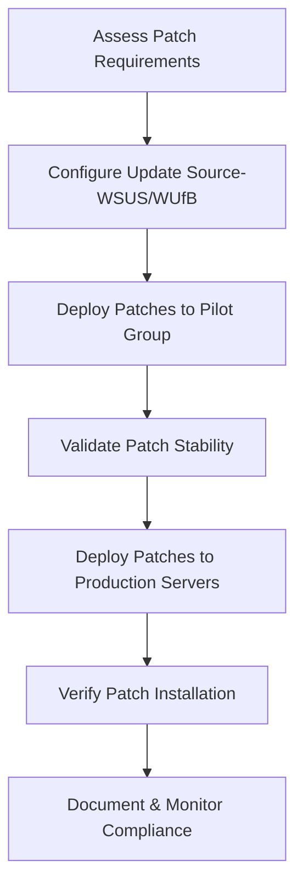

# Enterprise Windows Server Administration Knowledge Base  
## 13 — Windows Server Patch Management (Windows Server 2019)

---

## Overview

Patch management is essential for maintaining security, stability, and performance in enterprise Windows Server environments. Windows Server 2019 supports multiple patching mechanisms including Windows Update, WSUS, Windows Update for Business (WUfB), and PowerShell automation. Proper patch management reduces vulnerabilities, prevents exploitation, and ensures compliance with organizational security policies.

This document covers:
- Patch management concepts  
- Windows Update configuration  
- WSUS integration  
- WUfB policies  
- Patch deployment workflow  
- PowerShell patch automation  
- Servicing channels  
- Verification  
- Troubleshooting  
- Best practices  

---

## 🧩 Workflow Diagram — Patch Management Lifecycle



---

# 1. Patch Management Concepts

Patch management ensures:
- Security vulnerability remediation  
- OS stability  
- Feature improvements  
- Compliance with standards (CIS, ISO 27001)  

Patch types:
- Security updates  
- Cumulative updates  
- Feature updates  
- Driver updates  
- Definition updates  

---

# 2. Windows Update Configuration

## 2.1 Configure Windows Update Settings

### GUI

```
Settings → Update & Security → Windows Update
```

### PowerShell

```powershell
Get-WindowsUpdate
Install-WindowsUpdate -AcceptAll -AutoReboot
```

(Requires **PSWindowsUpdate** module.)

---

# 3. WSUS Integration

WSUS provides centralized patch management.

### GPO Path

```
Computer Configuration → Policies → Administrative Templates
→ Windows Components → Windows Update
```

### Required Settings

| Setting | Value |
|---------|--------|
| Specify intranet Microsoft update service location | http://SRV-WSUS01:8530 |
| Configure Automatic Updates | Enabled |
| Automatic Updates detection frequency | 4 hours |
| Allow signed updates from intranet Microsoft update service location | Enabled |

### Force client to check WSUS

```powershell
wuauclt /detectnow
wuauclt /reportnow
```

---

# 4. Windows Update for Business (WUfB)

WUfB is cloud‑based patch management via Microsoft Update.

### GPO Path

```
Computer Configuration → Policies → Administrative Templates
→ Windows Components → Windows Update → Windows Update for Business
```

### Key Policies

| Policy | Description |
|--------|-------------|
| Select when Quality Updates are received | Delay monthly updates |
| Select when Feature Updates are received | Delay OS upgrades |
| Automatic Updates | Configure install behavior |
| Update deferral periods | Control rollout timing |

---

# 5. Servicing Channels

Windows Server supports:

### Long-Term Servicing Channel (LTSC)
- Stable  
- Security updates only  
- No feature updates  

### Semi-Annual Channel (SAC) *(deprecated for Server)*
- Frequent updates  
- Cloud environments  

Windows Server 2019 uses **LTSC**.

---

# 6. Patch Deployment Workflow

### 1. **Pilot Deployment**
- Deploy patches to test servers  
- Validate functionality  
- Monitor logs  

### 2. **Production Deployment**
- Deploy patches to production servers  
- Schedule maintenance windows  
- Notify stakeholders  

### 3. **Post‑Deployment Verification**
- Check update status  
- Validate application functionality  
- Review event logs  

---

# 7. PowerShell Patch Automation

## 7.1 Install All Updates

```powershell
Install-WindowsUpdate -AcceptAll -AutoReboot
```

## 7.2 Install Only Security Updates

```powershell
Get-WindowsUpdate -Category Security | Install-WindowsUpdate -AcceptAll -AutoReboot
```

## 7.3 List Available Updates

```powershell
Get-WindowsUpdate
```

## 7.4 Export Update Report

```powershell
Get-WindowsUpdate -MicrosoftUpdate | Out-File "C:\Logs\UpdateReport.txt"
```

---

# 8. Patch Verification

### Check installed updates

```powershell
Get-HotFix
```

### Check last update time

```powershell
Get-WindowsUpdateLog
```

### Check WSUS reporting

```powershell
Get-WinEvent -LogName System | Where-Object {$_.Id -eq 19}
```

### Check update history

```powershell
wmic qfe list
```

---

# 9. Troubleshooting

| Issue | Cause | Fix |
|-------|-------|-----|
| Updates not installing | Corrupt SoftwareDistribution | Reset update components |
| WSUS not reporting | GPO misconfigured | Verify WSUS URL |
| Slow patching | Network congestion | Use local WSUS |
| Update failures | VSS issues | Restart VSS services |
| Feature update blocked | Deferral policies | Adjust WUfB settings |

### Reset Windows Update Components

```powershell
net stop wuauserv
net stop bits
Remove-Item -Path "C:\Windows\SoftwareDistribution" -Recurse -Force
net start wuauserv
net start bits
```

---

# 10. Best Practices

- Use WSUS for enterprise patching  
- Deploy patches to pilot group first  
- Schedule patch windows  
- Document patch cycles  
- Use PowerShell for automation  
- Monitor update compliance  
- Perform monthly patch reviews  
- Backup servers before major updates  
- Test patches for critical applications  

---

# References

- Microsoft Learn — Windows Update  
- Microsoft Learn — WSUS  
- Microsoft Learn — Windows Update for Business  
- Microsoft Learn — PSWindowsUpdate  
```

