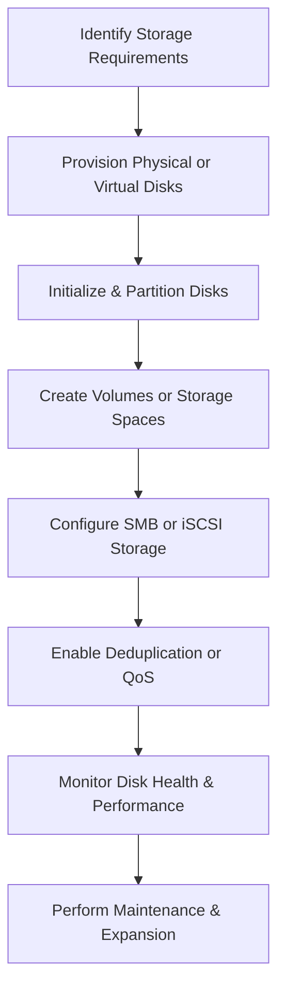

# Enterprise Windows Server Administration Knowledge Base  
## 14 — Windows Server Storage Management (Windows Server 2019)

---

## Overview

Storage management is a critical component of Windows Server administration. Windows Server 2019 provides robust tools for managing disks, volumes, Storage Spaces, SMB storage, iSCSI targets, and advanced resiliency features. Proper storage configuration ensures high availability, performance, scalability, and data protection across enterprise environments.

This document covers:
- Storage concepts  
- Disk initialization  
- Partitioning & formatting  
- Volume management  
- Storage Spaces  
- SMB storage  
- iSCSI configuration  
- Deduplication  
- Storage QoS  
- Monitoring & troubleshooting  
- Best practices  

---

## 🧩 Workflow Diagram — Storage Management Lifecycle



---

# 1. Storage Concepts

Windows Server storage includes:
- Basic & dynamic disks  
- MBR & GPT partition styles  
- NTFS & ReFS file systems  
- Storage Spaces (software RAID)  
- SMB 3.0 storage  
- iSCSI targets & initiators  
- Data deduplication  
- Storage QoS  

---

# 2. Disk Initialization

### View disks

```powershell
Get-Disk
```

### Initialize disk (GPT recommended)

```powershell
Initialize-Disk -Number 2 -PartitionStyle GPT
```

---

# 3. Partitioning & Formatting

### Create partition

```powershell
New-Partition -DiskNumber 2 -UseMaximumSize -AssignDriveLetter
```

### Format volume (NTFS)

```powershell
Format-Volume -DriveLetter F -FileSystem NTFS -NewFileSystemLabel "Data"
```

### Format volume (ReFS)

```powershell
Format-Volume -DriveLetter G -FileSystem ReFS -NewFileSystemLabel "Archive"
```

---

# 4. Volume Management

### Extend volume

```powershell
Resize-Partition -DriveLetter F -Size 200GB
```

### Shrink volume

```powershell
Resize-Partition -DriveLetter F -Size 100GB
```

### Check volume health

```powershell
Repair-Volume -DriveLetter F -Scan
```

---

# 5. Storage Spaces (Software RAID)

Storage Spaces provides:
- Mirroring  
- Parity  
- Simple (striped)  
- Resiliency  

### Create storage pool

```powershell
New-StoragePool -FriendlyName "CorpPool" -StorageSubSystemFriendlyName "Storage Spaces*" -PhysicalDisks (Get-PhysicalDisk -CanPool $true)
```

### Create virtual disk (mirror)

```powershell
New-VirtualDisk -StoragePoolFriendlyName "CorpPool" -FriendlyName "MirrorDisk" -ResiliencySettingName Mirror -Size 500GB
```

### Create volume on virtual disk

```powershell
New-Volume -FriendlyName "MirrorVol" -FileSystem NTFS -StoragePoolFriendlyName "CorpPool" -Size 500GB
```

---

# 6. SMB Storage Configuration

SMB 3.0 provides:
- Encryption  
- Signing  
- Multichannel  
- Transparent failover  

### Create SMB share

```powershell
New-SmbShare -Name "DataShare" -Path "F:\Data" -FullAccess "Corp\Admins"
```

### Enable SMB encryption

```powershell
Set-SmbShare -Name "DataShare" -EncryptData $true
```

### Enable SMB multichannel

```powershell
Set-SmbServerConfiguration -EnableMultiChannel $true
```

---

# 7. iSCSI Configuration

## 7.1 Install iSCSI Target Server

```powershell
Install-WindowsFeature FS-iSCSITarget-Server
```

## 7.2 Create iSCSI virtual disk

```powershell
New-IscsiVirtualDisk -Path "D:\iSCSI\Disk01.vhdx" -SizeBytes 100GB
```

## 7.3 Create iSCSI target

```powershell
New-IscsiServerTarget -TargetName "CorpTarget01" -InitiatorIds "IQN:iqn.1991-05.com.microsoft:server01"
```

## 7.4 Assign disk to target

```powershell
Add-IscsiVirtualDiskTargetMapping -TargetName "CorpTarget01" -Path "D:\iSCSI\Disk01.vhdx"
```

---

# 8. Data Deduplication

Deduplication reduces storage usage for:
- File servers  
- VDI  
- Backup volumes  

### Install deduplication

```powershell
Install-WindowsFeature FS-Data-Deduplication
```

### Enable deduplication

```powershell
Enable-DedupVolume -Volume F:
```

### Check dedup status

```powershell
Get-DedupStatus
```

---

# 9. Storage QoS (Quality of Service)

QoS ensures predictable performance.

### Create QoS policy

```powershell
New-StorageQosPolicy -Name "HighPriority" -MinimumIops 500 -MaximumIops 2000
```

### Assign policy to VM disk

```powershell
Set-VMHardDiskDrive -VMName "SRV-APP01" -ControllerLocation 0 -ControllerNumber 0 -QoSPolicyID (Get-StorageQosPolicy -Name "HighPriority").PolicyId
```

---

# 10. Monitoring Storage Health

### Check physical disk health

```powershell
Get-PhysicalDisk | Select FriendlyName, HealthStatus, OperationalStatus
```

### Check storage pool health

```powershell
Get-StoragePool
```

### Check virtual disk health

```powershell
Get-VirtualDisk
```

### Check SMB connections

```powershell
Get-SmbConnection
```

---

# 11. Troubleshooting

| Issue | Cause | Fix |
|-------|-------|-----|
| Disk offline | Controller issue | Reset disk or rescan |
| Slow performance | High disk queue | Check IOPS & latency |
| SMB access denied | NTFS permissions | Adjust ACLs |
| iSCSI disconnects | Network issues | Use dedicated NIC |
| Dedup errors | Unsupported volume | Use NTFS only |

---

# 12. Best Practices

- Use GPT for all modern disks  
- Use NTFS for general workloads  
- Use ReFS for backup & archival  
- Use Storage Spaces for resiliency  
- Enable SMB encryption for sensitive data  
- Use dedicated NICs for iSCSI  
- Monitor disk health regularly  
- Document storage architecture  
- Perform quarterly storage audits  

---

# References

- Microsoft Learn — Storage Spaces  
- Microsoft Learn — SMB 3.0  
- Microsoft Learn — iSCSI Target Server  
- Microsoft Learn — Data Deduplication  
```
