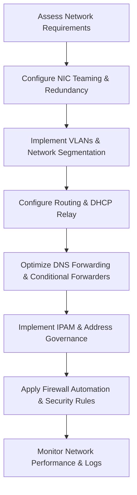

# Enterprise Windows Server Administration Knowledge Base  
## 15 — Windows Server Networking (Advanced)

---

## Overview

Advanced networking in Windows Server 2019 enables enterprise‑grade connectivity, performance optimization, segmentation, and secure communication across distributed environments. This document covers advanced networking concepts, including NIC teaming, VLANs, routing, DHCP relay, DNS forwarding, IPAM, firewall automation, and network performance tuning.

This guide builds on foundational networking principles and provides deep‑dive configuration steps for complex enterprise environments.

---

## 🧩 Workflow Diagram — Advanced Networking Lifecycle



---

# 1. NIC Teaming (Load Balancing & Failover)

NIC Teaming provides:
- Redundancy  
- Load balancing  
- Increased throughput  

### Create NIC Team

```powershell
New-NetLbfoTeam -Name "Team01" -TeamMembers "Ethernet","Ethernet2" -TeamingMode SwitchIndependent -LoadBalancingAlgorithm Dynamic
```

### View team status

```powershell
Get-NetLbfoTeam
```

### Add adapter to team

```powershell
Add-NetLbfoTeamMember -Team "Team01" -Name "Ethernet3"
```

---

# 2. VLAN Configuration

VLANs provide network segmentation and security.

### Assign VLAN ID to NIC

```powershell
Set-NetAdapterAdvancedProperty -Name "Ethernet" -DisplayName "VLAN ID" -DisplayValue 20
```

### Verify VLAN

```powershell
Get-NetAdapterAdvancedProperty -Name "Ethernet"
```

---

# 3. Routing (Static Routes)

Windows Server can act as a router.

### Add static route

```powershell
New-NetRoute -DestinationPrefix "10.20.0.0/16" -InterfaceAlias "Ethernet" -NextHop 192.168.10.1
```

### View routing table

```powershell
Get-NetRoute
```

---

# 4. DHCP Relay (IP Helper)

DHCP relay forwards DHCP requests across subnets.

### Enable DHCP relay

```powershell
Set-NetIPInterface -InterfaceAlias "Ethernet" -Dhcp Relay
```

### Configure IP helper address

```powershell
netsh interface ipv4 add dhcprelay 192.168.10.10
```

---

# 5. DNS Forwarding & Conditional Forwarders

### Add DNS forwarder

```powershell
Add-DnsServerForwarder -IPAddress 8.8.8.8
```

### Add conditional forwarder

```powershell
Add-DnsServerConditionalForwarderZone -Name "partner.local" -MasterServers 10.10.10.10
```

### View forwarders

```powershell
Get-DnsServerForwarder
```

---

# 6. IP Address Management (IPAM)

IPAM provides:
- IP tracking  
- DHCP/DNS integration  
- Address utilization reports  

### Install IPAM

```powershell
Install-WindowsFeature IPAM -IncludeManagementTools
```

### Provision IPAM

```powershell
Invoke-IpamServerProvisioning -ProvisioningType Manual
```

### Start IPAM discovery

```powershell
Start-IpamDiscovery
```

---

# 7. Windows Firewall Automation

### Enable firewall for all profiles

```powershell
Set-NetFirewallProfile -Profile Domain,Public,Private -Enabled True
```

### Create inbound rule

```powershell
New-NetFirewallRule -DisplayName "Allow-App01" -Direction Inbound -Protocol TCP -LocalPort 8080 -Action Allow
```

### Create outbound rule

```powershell
New-NetFirewallRule -DisplayName "Block-FTP" -Direction Outbound -Protocol TCP -RemotePort 21 -Action Block
```

### View firewall rules

```powershell
Get-NetFirewallRule
```

---

# 8. Network Performance Tuning

## 8.1 Enable Receive Side Scaling (RSS)

```powershell
Set-NetAdapterRss -Name "Ethernet" -Enabled $true
```

## 8.2 Enable Jumbo Frames (if supported)

```powershell
Set-NetAdapterAdvancedProperty -Name "Ethernet" -DisplayName "Jumbo Packet" -DisplayValue "9014"
```

## 8.3 Enable TCP Chimney Offload

```powershell
netsh int tcp set global chimney=enabled
```

## 8.4 Optimize TCP settings

```powershell
netsh int tcp set global autotuninglevel=normal
netsh int tcp set global congestionprovider=ctcp
```

---

# 9. Network Diagnostics

### Test DNS resolution

```powershell
Resolve-DnsName corp.local
```

### Test network latency

```powershell
Test-Connection -ComputerName DC01 -Count 4
```

### Test port connectivity

```powershell
Test-NetConnection -ComputerName SRV-APP01 -Port 443
```

### View active connections

```powershell
Get-NetTCPConnection
```

---

# 10. Network Logging & Monitoring

### Enable firewall logging

```powershell
Set-NetFirewallProfile -Profile Domain -LogAllowed True -LogBlocked True -LogFileName "C:\Logs\Firewall.log"
```

### View NIC statistics

```powershell
Get-NetAdapterStatistics
```

### Monitor bandwidth usage

```powershell
Get-Counter '\Network Interface(*)\Bytes Total/sec'
```

---

# 11. Troubleshooting

| Issue | Cause | Fix |
|-------|-------|-----|
| NIC team down | Adapter failure | Replace NIC |
| VLAN not working | Switch misconfigured | Verify trunking |
| DNS slow | Wrong forwarders | Use reliable DNS |
| Routing issues | Incorrect next hop | Validate route table |
| Firewall blocking traffic | Wrong rule | Adjust inbound/outbound rules |

---

# 12. Best Practices

- Use NIC teaming for redundancy  
- Use VLANs for segmentation  
- Use conditional forwarders for partner networks  
- Use IPAM for IP governance  
- Automate firewall rules with PowerShell  
- Enable RSS and jumbo frames for high throughput  
- Document all network changes  
- Monitor network performance regularly  
- Perform quarterly network audits  

---

# References

- Microsoft Learn — Windows Networking  
- Microsoft Learn — NIC Teaming  
- Microsoft Learn — DNS Server  
- Microsoft Learn — IPAM  
- Microsoft Learn — Windows Firewall  
```

