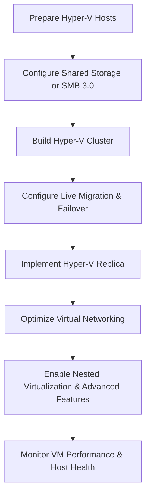

# Enterprise Windows Server Administration Knowledge Base  
## 16 — Windows Server Virtualization (Advanced)

---

## Overview

Advanced virtualization in Windows Server 2019 builds on Hyper‑V fundamentals to deliver enterprise‑grade scalability, high availability, disaster recovery, and performance optimization. This document covers advanced Hyper‑V features including clustering, live migration, replica, virtual networking, storage integration, nested virtualization, and performance tuning.

This guide is designed for production environments requiring resilient, scalable, and secure virtualization infrastructure.

---

## 🧩 Workflow Diagram — Advanced Virtualization Lifecycle



---

# 1. Hyper‑V Clustering (High Availability)

Hyper‑V clustering provides:
- Automatic failover  
- High availability  
- Shared storage support  
- Cluster‑aware updating  

## 1.1 Install Failover Clustering

```powershell
Install-WindowsFeature Failover-Clustering -IncludeManagementTools
```

## 1.2 Validate Cluster

```powershell
Test-Cluster -Node SRV-HV01, SRV-HV02
```

## 1.3 Create Cluster

```powershell
New-Cluster -Name "HVCluster01" -Node SRV-HV01, SRV-HV02 -StaticAddress 192.168.10.50
```

## 1.4 Add Cluster Shared Volume (CSV)

```powershell
Add-ClusterSharedVolume -Name "Cluster Disk 1"
```

---

# 2. Live Migration (Zero‑Downtime VM Movement)

Live migration allows moving running VMs between hosts.

## 2.1 Enable Live Migration

```powershell
Set-VMHost -VirtualMachineMigrationEnabled $true
```

## 2.2 Configure Authentication

```powershell
Set-VMHost -VirtualMachineMigrationAuthenticationType CredSSP
```

## 2.3 Set Migration Network

```powershell
Set-VMHost -VirtualMachineMigrationNetwork 10.10.10.0/24
```

## 2.4 Perform Live Migration

```powershell
Move-VM -Name "SRV-APP01" -DestinationHost "SRV-HV02"
```

---

# 3. Hyper‑V Replica (Disaster Recovery)

Replica provides asynchronous VM replication between hosts or sites.

## 3.1 Enable Replica Server

```powershell
Set-VMReplicationServer -ReplicationEnabled $true -AllowedAuthenticationType Kerberos
```

## 3.2 Enable VM Replication

```powershell
Enable-VMReplication -VMName "SRV-APP01" -ReplicaServerName "SRV-HV02" -ReplicaServerPort 80
```

## 3.3 Start Initial Replication

```powershell
Start-VMInitialReplication -VMName "SRV-APP01"
```

## 3.4 Failover VM

```powershell
Start-VMFailover -VMName "SRV-APP01"
```

---

# 4. Advanced Virtual Networking

## 4.1 Create Logical Networks

```powershell
New-VMSwitch -Name "ProdNet" -NetAdapterName "Ethernet" -AllowManagementOS $true
New-VMSwitch -Name "StorageNet" -NetAdapterName "Ethernet2" -AllowManagementOS $false
```

## 4.2 Configure VLANs

```powershell
Set-VMNetworkAdapterVlan -VMName "SRV-APP01" -Access -VlanId 30
```

## 4.3 Enable SR-IOV (if supported)

```powershell
Set-VMNetworkAdapter -VMName "SRV-DB01" -IovWeight 100
```

## 4.4 Enable NIC Teaming inside VM (optional)

```powershell
New-NetLbfoTeam -Name "VMTeam" -TeamMembers "Ethernet","Ethernet2"
```

---

# 5. Advanced Storage Integration

## 5.1 Use SMB 3.0 for VM Storage

```powershell
New-SmbShare -Name "VMStorage" -Path "D:\VMs" -FullAccess "HVClusterAdmins"
Set-SmbShare -Name "VMStorage" -EncryptData $true
```

## 5.2 Use Shared VHDX for Guest Clustering

```powershell
Set-VHD -Path "D:\ClusterDisks\SharedDisk.vhdx" -ShareVirtualDisk $true
```

## 5.3 Enable Storage QoS

```powershell
New-StorageQosPolicy -Name "VMHighPriority" -MinimumIops 500 -MaximumIops 2000
```

---

# 6. Nested Virtualization

Nested virtualization allows running Hyper‑V inside a VM.

### Enable nested virtualization

```powershell
Set-VMProcessor -VMName "SRV-HYP01" -ExposeVirtualizationExtensions $true
```

### Enable MAC spoofing (required)

```powershell
Set-VMNetworkAdapter -VMName "SRV-HYP01" -MacAddressSpoofing On
```

---

# 7. Shielded VMs (Advanced Security)

Shielded VMs protect against:
- Host compromise  
- Unauthorized access  
- VM tampering  

### Install Host Guardian Service (HGS)

```powershell
Install-WindowsFeature HostGuardianServiceRole -IncludeManagementTools
```

### Configure shielding

```powershell
Set-VM -Name "SRV-SEC01" -Shielded $true
```

---

# 8. VM Performance Optimization

## 8.1 Enable Dynamic Memory

```powershell
Set-VMMemory -VMName "SRV-APP01" -DynamicMemoryEnabled $true -MinimumBytes 2GB -MaximumBytes 8GB
```

## 8.2 Enable NUMA spanning

```powershell
Set-VMHost -NumaSpanningEnabled $true
```

## 8.3 Enable CPU compatibility for migration

```powershell
Set-VMProcessor -VMName "SRV-APP01" -CompatibilityForMigrationEnabled $true
```

---

# 9. Monitoring Virtualization Health

### Check VM status

```powershell
Get-VM
```

### Check cluster health

```powershell
Get-ClusterGroup
```

### Check live migration performance

```powershell
Get-Counter '\Hyper-V Hypervisor Virtual Processor(*)\% Guest Run Time'
```

### Check replica health

```powershell
Get-VMReplication
```

---

# 10. Troubleshooting

| Issue | Cause | Fix |
|-------|-------|-----|
| Live migration fails | Authentication mismatch | Use CredSSP |
| Replica not syncing | Network issues | Check firewall & ports |
| VM slow | Incorrect NUMA | Enable NUMA spanning |
| Cluster unstable | Storage issues | Validate CSV health |
| Nested virtualization fails | CPU unsupported | Enable VT‑x/AMD‑V |

---

# 11. Best Practices

- Use clustering for high availability  
- Use Hyper‑V Replica for DR  
- Use SMB 3.0 or CSV for shared storage  
- Use VLANs for segmentation  
- Enable dynamic memory for efficiency  
- Use NUMA for performance  
- Document VM configurations  
- Monitor cluster health regularly  
- Perform quarterly virtualization audits  

---

# References

- Microsoft Learn — Hyper‑V  
- Microsoft Learn — Failover Clustering  
- Microsoft Learn — Hyper‑V Replica  
- Microsoft Learn — Virtual Networking  
```
