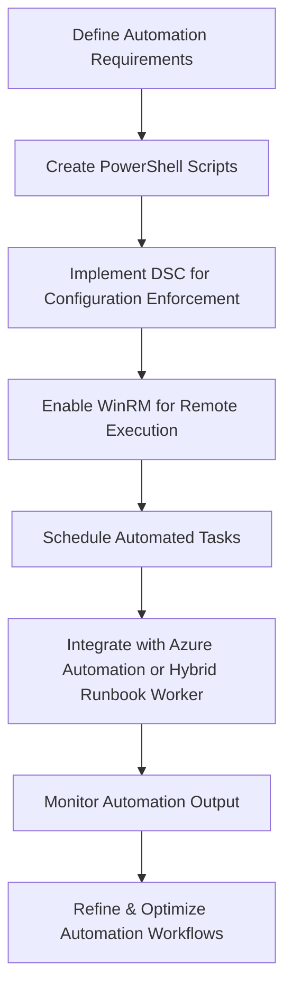

# Enterprise Windows Server Administration Knowledge Base  
## 17 — Windows Server Automation and Orchestration (Windows Server 2019)

---

## Overview

Automation and orchestration are essential for modern Windows Server environments. They reduce manual effort, eliminate configuration drift, improve consistency, and enable scalable enterprise operations. Windows Server 2019 supports multiple automation frameworks including PowerShell, Desired State Configuration (DSC), Task Scheduler, WinRM, and hybrid orchestration via Azure Automation.

This document covers:
- Automation concepts  
- PowerShell automation  
- Desired State Configuration (DSC)  
- WinRM & remote execution  
- Task Scheduler automation  
- Server provisioning automation  
- Patch orchestration  
- Hybrid cloud automation  
- Monitoring & reporting  
- Troubleshooting  
- Best practices  

---

## 🧩 Workflow Diagram — Automation & Orchestration Lifecycle



---

# 1. Automation Concepts

Automation provides:
- Consistency  
- Repeatability  
- Reduced human error  
- Faster deployments  
- Scalable operations  

Orchestration coordinates:
- Multi‑step workflows  
- Cross‑server operations  
- Hybrid cloud tasks  
- Scheduled maintenance  

---

# 2. PowerShell Automation

PowerShell is the core automation engine for Windows Server.

## 2.1 Script Execution Policy

```powershell
Set-ExecutionPolicy RemoteSigned -Force
```

## 2.2 Run script remotely

```powershell
Invoke-Command -ComputerName SRV-APP01 -ScriptBlock { Get-Service }
```

## 2.3 Create reusable functions

```powershell
function Restart-AppService {
    param([string]$ServiceName)
    Restart-Service -Name $ServiceName -Force
}
```

## 2.4 Automate role installation

```powershell
Install-WindowsFeature AD-Domain-Services, DNS -IncludeManagementTools
```

---

# 3. Desired State Configuration (DSC)

DSC enforces configuration consistency across servers.

## 3.1 Create DSC configuration

```powershell
Configuration CorpBaseline {
    Node "SRV-APP01" {
        WindowsFeature WebServer {
            Name = "Web-Server"
            Ensure = "Present"
        }

        File LogFolder {
            DestinationPath = "C:\Logs"
            Type = "Directory"
            Ensure = "Present"
        }
    }
}
```

## 3.2 Compile DSC

```powershell
CorpBaseline
```

## 3.3 Apply DSC

```powershell
Start-DscConfiguration -Path .\CorpBaseline -Wait -Verbose
```

## 3.4 Check DSC status

```powershell
Get-DscConfigurationStatus
```

---

# 4. WinRM & Remote Execution

WinRM enables remote PowerShell sessions.

## 4.1 Enable WinRM

```powershell
Enable-PSRemoting -Force
```

## 4.2 Create remote session

```powershell
$s = New-PSSession -ComputerName SRV-DB01
Enter-PSSession $s
```

## 4.3 Copy files remotely

```powershell
Copy-Item "C:\Scripts\Baseline.ps1" -Destination "C:\Scripts" -ToSession $s
```

---

# 5. Task Scheduler Automation

Task Scheduler runs scripts automatically.

## 5.1 Create scheduled task

```powershell
$action = New-ScheduledTaskAction -Execute "PowerShell.exe" -Argument "-File C:\Scripts\Backup.ps1"
$trigger = New-ScheduledTaskTrigger -Daily -At 03:00
Register-ScheduledTask -TaskName "DailyBackup" -Action $action -Trigger $trigger -User "SYSTEM"
```

## 5.2 View tasks

```powershell
Get-ScheduledTask
```

---

# 6. Server Provisioning Automation

Automate server setup using scripts.

## 6.1 Automated baseline script

```powershell
Install-WindowsFeature FS-FileServer
Set-NetFirewallProfile -Profile Domain -Enabled True
Rename-Computer -NewName "SRV-FS01"
```

## 6.2 Automated domain join

```powershell
Add-Computer -DomainName corp.local -Credential corp\Admin -Restart
```

---

# 7. Patch Orchestration

Automate patching across servers.

## 7.1 Install updates

```powershell
Install-WindowsUpdate -AcceptAll -AutoReboot
```

## 7.2 Patch multiple servers

```powershell
Invoke-Command -ComputerName SRV-APP01, SRV-DB01 -ScriptBlock {
    Install-WindowsUpdate -AcceptAll -AutoReboot
}
```

---

# 8. Hybrid Cloud Automation (Azure Automation)

Azure Automation provides:
- Cloud runbooks  
- Hybrid runbook workers  
- Patch orchestration  
- Inventory & change tracking  

## 8.1 Install Hybrid Runbook Worker

```powershell
Add-HybridRunbookWorker -GroupName "CorpServers"
```

## 8.2 Run cloud automation locally

```powershell
Start-AutomationRunbook -Name "CorpBaseline"
```

---

# 9. Monitoring & Reporting

### Check automation logs

```powershell
Get-WinEvent -LogName "Microsoft-Windows-PowerShell/Operational"
```

### Export automation report

```powershell
Get-ScheduledTask | Export-Csv "C:\Reports\Tasks.csv"
```

### DSC compliance report

```powershell
Get-DscConfigurationStatus | Format-List
```

---

# 10. Troubleshooting

| Issue | Cause | Fix |
|-------|-------|-----|
| Script fails | Execution policy | Set RemoteSigned |
| DSC not applying | Resource conflict | Review DSC logs |
| WinRM fails | Firewall blocked | Enable WinRM rules |
| Scheduled task not running | Wrong user context | Use SYSTEM |
| Azure automation fails | Worker offline | Restart hybrid worker |

---

# 11. Best Practices

- Use PowerShell for all automation  
- Use DSC for configuration enforcement  
- Use WinRM for remote orchestration  
- Use scheduled tasks for recurring jobs  
- Use Azure Automation for hybrid orchestration  
- Store scripts in Git repositories  
- Use signed scripts in production  
- Document automation workflows  
- Monitor automation logs regularly  

---

# References

- Microsoft Learn — PowerShell  
- Microsoft Learn — DSC  
- Microsoft Learn — WinRM  
- Microsoft Learn — Azure Automation  
```
