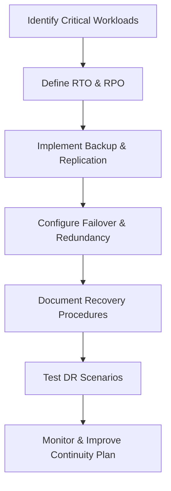

# Enterprise Windows Server Administration Knowledge Base  
## 18 — Disaster Recovery and Business Continuity (Windows Server 2019)

---

## Overview

Disaster Recovery (DR) and Business Continuity (BC) ensure that critical Windows Server workloads remain available during unexpected outages, cyber incidents, hardware failures, or natural disasters. Windows Server 2019 provides multiple built‑in technologies for backup, replication, failover, and continuity planning.

This document covers:
- DR & BC concepts  
- Risk assessment  
- Recovery objectives (RTO/RPO)  
- Backup strategies  
- Hyper‑V Replica  
- Failover Clustering  
- Active Directory recovery  
- File server recovery  
- Application‑specific DR  
- Testing & validation  
- Troubleshooting  
- Best practices  

---

## 🧩 Workflow Diagram — Disaster Recovery Lifecycle



---

# 1. Disaster Recovery Concepts

DR ensures:
- Rapid restoration of services  
- Minimal data loss  
- Continuity of operations  

BC ensures:
- Organizational resilience  
- Alternative workflows  
- Long‑term recovery  

Key metrics:
- **RTO (Recovery Time Objective)** — maximum acceptable downtime  
- **RPO (Recovery Point Objective)** — maximum acceptable data loss  

---

# 2. Risk Assessment

Common risks:
- Hardware failure  
- Ransomware  
- Data corruption  
- Network outages  
- Natural disasters  
- Human error  

Perform:
- Asset inventory  
- Impact analysis  
- Risk prioritization  

---

# 3. Backup Strategies

### 3.1 Full Server Backup

```powershell
wbadmin start backup -backupTarget:E: -include:C: -allCritical -quiet
```

### 3.2 System State Backup

```powershell
wbadmin start systemstatebackup -backupTarget:E: -quiet
```

### 3.3 Offsite Backup

Recommended:
- Cloud storage  
- Secondary datacenter  
- Encrypted external drives  

### 3.4 Backup Frequency

| Workload | Frequency |
|----------|-----------|
| Domain Controllers | Daily system state |
| File Servers | Hourly shadow copies |
| Application Servers | Daily full backup |
| Databases | 15–60 min log backups |

---

# 4. Hyper‑V Replica (Site‑to‑Site DR)

Hyper‑V Replica provides asynchronous VM replication.

### Enable Replica Server

```powershell
Set-VMReplicationServer -ReplicationEnabled $true -AllowedAuthenticationType Kerberos
```

### Enable VM Replication

```powershell
Enable-VMReplication -VMName "SRV-APP01" -ReplicaServerName "DR-HV01" -ReplicaServerPort 80
```

### Failover VM

```powershell
Start-VMFailover -VMName "SRV-APP01"
```

---

# 5. Failover Clustering (High Availability)

Failover clustering provides automatic failover.

### Install Failover Clustering

```powershell
Install-WindowsFeature Failover-Clustering -IncludeManagementTools
```

### Validate Cluster

```powershell
Test-Cluster -Node SRV-HV01, SRV-HV02
```

### Create Cluster

```powershell
New-Cluster -Name "ProdCluster" -Node SRV-HV01, SRV-HV02 -StaticAddress 192.168.10.50
```

---

# 6. Active Directory Disaster Recovery

### 6.1 System State Restore

```powershell
wbadmin start systemstaterecovery -version:<ID> -quiet
```

### 6.2 Authoritative Restore (NTDS)

```powershell
ntdsutil "activate instance ntds" "authoritative restore" "restore subtree OU=CorpUsers,DC=corp,DC=local"
```

### 6.3 Non‑Authoritative Restore

Used for replication‑based recovery.

---

# 7. File Server Disaster Recovery

### 7.1 Shadow Copy Restore

```powershell
vssadmin list shadows
```

### 7.2 Restore from backup

```powershell
wbadmin start recovery -version:<ID> -itemType:File -items:F:\Shares
```

### 7.3 DFS Replication Recovery

```powershell
dfsrdiag pollad
```

---

# 8. Application‑Specific DR

### SQL Server

- Full backups  
- Log backups  
- AlwaysOn Availability Groups  
- Replication  

### Exchange Server

- DAG (Database Availability Group)  
- Circular logging  
- Offsite backups  

### IIS Web Servers

```powershell
appcmd add backup "DailyBackup"
```

---

# 9. Testing & Validation

### Perform DR drills

- Quarterly recommended  
- Validate RTO/RPO  
- Test failover scenarios  
- Test restore procedures  

### Validate backup integrity

```powershell
wbadmin get versions
```

### Validate replica health

```powershell
Get-VMReplication
```

---

# 10. Troubleshooting

| Issue | Cause | Fix |
|-------|-------|-----|
| Backup fails | VSS errors | Restart VSS |
| Replica not syncing | Network issues | Check firewall |
| Cluster unstable | CSV issues | Validate storage |
| AD restore fails | Wrong restore type | Use authoritative/non-authoritative |
| Slow recovery | Insufficient bandwidth | Use compression or offline restore |

---

# 11. Best Practices

- Define clear RTO/RPO  
- Use offsite and cloud backups  
- Use Hyper‑V Replica for DR  
- Use clustering for HA  
- Document DR procedures  
- Test DR plans regularly  
- Encrypt backup storage  
- Monitor backup and replication health  
- Perform quarterly DR audits  

---

# References

- Microsoft Learn — Disaster Recovery  
- Microsoft Learn — Hyper‑V Replica  
- Microsoft Learn — Failover Clustering  
- Microsoft Learn — Windows Server Backup  
```
