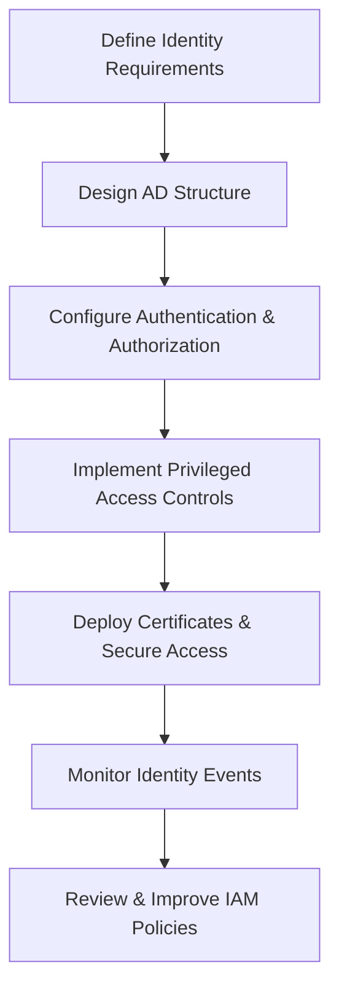

# Enterprise Windows Server Administration Knowledge Base  
## 19 — Identity and Access Management (Windows Server 2019)

---

## Overview

Identity and Access Management (IAM) is the foundation of enterprise security. Windows Server 2019 provides a comprehensive IAM ecosystem through Active Directory Domain Services (AD DS), Group Policy, Kerberos authentication, certificate services, privileged access management, and modern hybrid identity integrations.

This document covers:
- IAM concepts  
- Active Directory structure  
- Authentication protocols  
- Authorization models  
- Privileged access management  
- Password & account policies  
- Group management  
- Role‑based access control (RBAC)  
- Certificate‑based authentication  
- Just‑Enough Administration (JEA)  
- Auditing & monitoring  
- Troubleshooting  
- Best practices  

---

## 🧩 Workflow Diagram — IAM Lifecycle



---

# 1. IAM Concepts

IAM ensures:
- Secure authentication  
- Controlled authorization  
- Least privilege access  
- Identity lifecycle management  
- Compliance with security standards  

Core components:
- Users  
- Groups  
- Roles  
- Policies  
- Credentials  
- Tokens  

---

# 2. Active Directory Structure

### Recommended AD Structure

```
corp.local
 ├── Corp Users
 ├── Corp Computers
 │     ├── Workstations
 │     └── Servers
 ├── Service Accounts
 ├── Admin Accounts
 └── Groups
```

### Key AD Objects
- **Users** — identity principals  
- **Groups** — authorization containers  
- **OUs** — organizational boundaries  
- **Service Accounts** — application identities  
- **Managed Service Accounts (MSA/gMSA)** — secure automated accounts  

---

# 3. Authentication Protocols

### Kerberos (default)
- Ticket‑based  
- Fast  
- Secure  
- Supports delegation  

### NTLM (legacy)
- Used when Kerberos fails  
- Should be minimized  

### Certificate‑based authentication
- Smart cards  
- PKI integration  

### LDAP & LDAPS
- Directory queries  
- LDAPS recommended for security  

---

# 4. Authorization Models

### Role‑Based Access Control (RBAC)

Assign permissions based on roles:

```
Role → Group → Permission → Resource
```

### Group Types

| Type | Purpose |
|------|---------|
| Security | Access control |
| Distribution | Email lists |

### Group Scopes

| Scope | Usage |
|--------|--------|
| Domain Local | Resource permissions |
| Global | Department groups |
| Universal | Multi‑domain groups |

---

# 5. Privileged Access Management (PAM)

### 5.1 Tiered Administration Model

```
Tier 0 — Domain Controllers, PKI, ADFS  
Tier 1 — Servers, Applications  
Tier 2 — Workstations, Users
```

### 5.2 Admin Account Separation

- Admin accounts separate from user accounts  
- No internet access for admin accounts  
- No email access for admin accounts  

### 5.3 Protected Users Group

```powershell
Add-ADGroupMember -Identity "Protected Users" -Members "Admin01"
```

### 5.4 Privileged Access Workstations (PAWs)

Dedicated secure workstations for admin tasks.

---

# 6. Password & Account Policies

### GPO Path

```
Computer Configuration → Policies → Windows Settings → Security Settings → Account Policies
```

### Recommended Settings

| Policy | Value |
|--------|--------|
| Minimum password length | 12–16 |
| Complexity | Enabled |
| Maximum password age | 60 days |
| Lockout threshold | 5 attempts |
| Lockout duration | 15 minutes |

### Fine‑Grained Password Policies

```powershell
New-ADPasswordPolicy -Name "AdminsPolicy" -ComplexityEnabled $true -MinPasswordLength 14 -LockoutThreshold 3
```

---

# 7. Group Management

### Create group

```powershell
New-ADGroup -Name "Finance-Users" -GroupScope Global -GroupCategory Security
```

### Add user to group

```powershell
Add-ADGroupMember -Identity "Finance-Users" -Members "John.Doe"
```

### Remove user

```powershell
Remove-ADGroupMember -Identity "Finance-Users" -Members "John.Doe" -Confirm:$false
```

---

# 8. Certificate‑Based Authentication (PKI)

### Install AD CS

```powershell
Install-WindowsFeature ADCS-Cert-Authority -IncludeManagementTools
```

### Configure CA

```powershell
Install-AdcsCertificationAuthority -CAType EnterpriseRootCA
```

### Issue smart card certificates

```powershell
certreq -submit request.req
```

---

# 9. Just‑Enough Administration (JEA)

JEA provides minimal‑privilege PowerShell endpoints.

### Create JEA role capability

```powershell
New-PSRoleCapabilityFile -Path "C:\Program Files\WindowsPowerShell\Modules\CorpJEA\RoleCapabilities\CorpAdmin.psrc"
```

### Create JEA session configuration

```powershell
New-PSSessionConfigurationFile -Path "C:\CorpJEA\CorpAdmin.pssc" -SessionType RestrictedRemoteServer
```

### Register JEA endpoint

```powershell
Register-PSSessionConfiguration -Name "CorpAdmin" -Path "C:\CorpJEA\CorpAdmin.pssc"
```

---

# 10. Auditing & Monitoring

### Enable logon auditing

```powershell
auditpol /set /category:"Logon/Logoff" /success:enable /failure:enable
```

### View identity events

```powershell
Get-WinEvent -LogName Security | Where-Object {$_.Id -eq 4624}
```

### Monitor group membership changes

```powershell
Get-WinEvent -LogName Security | Where-Object {$_.Id -eq 4728}
```

---

# 11. Troubleshooting

| Issue | Cause | Fix |
|-------|-------|-----|
| Kerberos failures | Time skew | Sync NTP |
| NTLM fallback | SPN issues | Fix SPNs |
| Group policy not applying | Wrong OU | Move object |
| Account lockouts | Password mismatch | Use lockout tools |
| Certificate errors | CRL unreachable | Fix CDP/AIA paths |

---

# 12. Best Practices

- Use RBAC for authorization  
- Use strong password policies  
- Use MFA for privileged accounts  
- Use PAWs for admin tasks  
- Minimize NTLM usage  
- Use JEA for least privilege  
- Monitor identity events  
- Document IAM architecture  
- Perform quarterly IAM audits  

---

# References

- Microsoft Learn — Active Directory  
- Microsoft Learn — Identity Management  
- Microsoft Learn — Kerberos  
- Microsoft Learn — AD CS  
```
