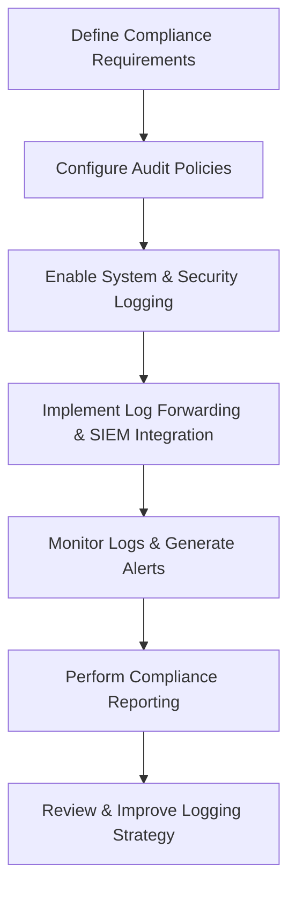

# Enterprise Windows Server Administration Knowledge Base  
## 20 — Logging, Auditing, and Compliance (Windows Server 2019)

---

## Overview

Logging, auditing, and compliance are essential pillars of enterprise security and governance. Windows Server 2019 provides extensive capabilities for capturing system events, monitoring user activity, enforcing audit policies, and generating compliance‑ready reports. Proper configuration ensures visibility, accountability, and adherence to regulatory frameworks such as ISO 27001, SOC 2, PCI‑DSS, and NIST.

This document covers:
- Logging concepts  
- Event log architecture  
- Audit policy configuration  
- Advanced audit policy  
- PowerShell logging  
- Sysmon integration  
- Log forwarding  
- SIEM integration  
- Compliance reporting  
- Monitoring & alerting  
- Troubleshooting  
- Best practices  

---

## 🧩 Workflow Diagram — Logging & Compliance Lifecycle



---

# 1. Logging Concepts

Logging provides:
- Visibility into system activity  
- Detection of anomalies  
- Forensic evidence  
- Compliance documentation  

Auditing provides:
- Accountability  
- Traceability  
- Security enforcement  

Compliance ensures:
- Regulatory adherence  
- Policy enforcement  
- Risk reduction  

---

# 2. Event Log Architecture

Windows Server logs include:

### System Logs
- Kernel events  
- Driver issues  
- Hardware failures  

### Application Logs
- Application‑specific events  

### Security Logs
- Authentication  
- Authorization  
- Privilege use  
- Object access  

### Setup Logs
- Installation events  

### Forwarded Events
- Centralized logging  

---

# 3. Audit Policy Configuration

### GPO Path

```
Computer Configuration → Policies → Windows Settings → Security Settings → Local Policies → Audit Policy
```

### Recommended Audit Policies

| Policy | Success | Failure |
|--------|---------|---------|
| Logon events | ✔ | ✔ |
| Account logon | ✔ | ✔ |
| Object access | ✔ | ✔ |
| Policy change | ✔ | ✔ |
| Privilege use | ✔ | ✔ |
| System events | ✔ | ✔ |
| Account management | ✔ | ✔ |

### Configure via PowerShell

```powershell
auditpol /set /category:"Logon/Logoff" /success:enable /failure:enable
auditpol /set /category:"Account Management" /success:enable /failure:enable
auditpol /set /category:"Object Access" /success:enable /failure:enable
```

---

# 4. Advanced Audit Policy Configuration

Advanced audit policy provides granular control.

### GPO Path

```
Computer Configuration → Policies → Windows Settings → Security Settings → Advanced Audit Policy Configuration
```

### Recommended Categories

- Logon/Logoff  
- Account Logon  
- Object Access  
- Policy Change  
- Privilege Use  
- System Integrity  
- DS Access  
- Detailed Tracking  

### Example: Enable detailed tracking

```powershell
auditpol /set /subcategory:"Process Creation" /success:enable /failure:enable
```

---

# 5. PowerShell Logging

PowerShell logging is critical for detecting malicious scripts.

### Enable Script Block Logging

```powershell
Set-ItemProperty "HKLM:\Software\Policies\Microsoft\Windows\PowerShell\ScriptBlockLogging" -Name "EnableScriptBlockLogging" -Value 1
```

### Enable Module Logging

```powershell
Set-ItemProperty "HKLM:\Software\Policies\Microsoft\Windows\PowerShell\ModuleLogging" -Name "EnableModuleLogging" -Value 1
```

### Enable Transcription

```powershell
Set-ItemProperty "HKLM:\Software\Policies\Microsoft\Windows\PowerShell\Transcription" -Name "EnableTranscripting" -Value 1
```

---

# 6. Sysmon Integration (Advanced Threat Detection)

Sysmon (System Monitor) provides detailed process, network, and file activity logs.

### Install Sysmon

```powershell
sysmon64.exe -i sysmonconfig.xml
```

### View Sysmon logs

```powershell
Get-WinEvent -LogName "Microsoft-Windows-Sysmon/Operational"
```

---

# 7. Log Forwarding (Centralized Logging)

### Enable Windows Event Forwarding (WEF)

#### On Collector

```powershell
wecutil qc
```

#### On Client

```powershell
winrm quickconfig
```

### Create subscription

```powershell
wecutil cs subscription.xml
```

---

# 8. SIEM Integration

Common SIEM platforms:
- Microsoft Sentinel  
- Splunk  
- QRadar  
- Elastic Stack  

### Forward logs to SIEM

```powershell
nxlog.exe -f nxlog.conf
```

### Forward via Winlogbeat (Elastic)

```powershell
winlogbeat.exe setup
```

---

# 9. Compliance Reporting

### Generate security event report

```powershell
Get-WinEvent -LogName Security | Export-Csv "C:\Reports\SecurityLog.csv"
```

### Generate privileged access report

```powershell
Get-WinEvent -LogName Security | Where-Object {$_.Id -eq 4672}
```

### Generate group membership change report

```powershell
Get-WinEvent -LogName Security | Where-Object {$_.Id -eq 4728}
```

---

# 10. Monitoring & Alerting

### Monitor failed logons

```powershell
Get-WinEvent -LogName Security | Where-Object {$_.Id -eq 4625}
```

### Monitor privilege escalation

```powershell
Get-WinEvent -LogName Security | Where-Object {$_.Id -eq 4672}
```

### Monitor PowerShell activity

```powershell
Get-WinEvent -LogName "Microsoft-Windows-PowerShell/Operational"
```

---

# 11. Troubleshooting

| Issue | Cause | Fix |
|-------|-------|-----|
| Logs missing | Policy misconfigured | Check GPO |
| Security log full | Small log size | Increase log size |
| PowerShell logs missing | Logging disabled | Enable script block logging |
| Sysmon not logging | Config error | Validate XML |
| WEF not forwarding | WinRM disabled | Enable WinRM |

---

# 12. Best Practices

- Enable advanced audit policy  
- Enable PowerShell logging  
- Use Sysmon for deep visibility  
- Forward logs to SIEM  
- Monitor privileged access  
- Increase log retention  
- Document audit policies  
- Perform quarterly compliance reviews  
- Protect logs from tampering  

---

# References

- Microsoft Learn — Windows Auditing  
- Microsoft Learn — Sysmon  
- Microsoft Learn — Windows Event Forwarding  
- Microsoft Learn — SIEM Integration  
```
