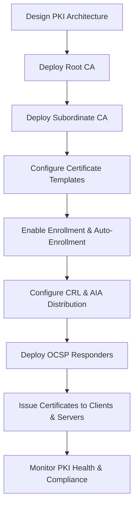

# Enterprise Windows Server Administration Knowledge Base  
## 21 — Public Key Infrastructure (PKI) and Certificate Services (Windows Server 2019)

---

## Overview

Public Key Infrastructure (PKI) is the backbone of secure identity, encryption, authentication, and trust within enterprise environments. Windows Server 2019 provides a full-featured PKI solution through Active Directory Certificate Services (AD CS), enabling certificate issuance, renewal, revocation, smart card authentication, HTTPS/TLS security, code signing, and secure device onboarding.

This document covers:
- PKI concepts  
- AD CS architecture  
- Root & subordinate CA design  
- Certificate templates  
- Enrollment & auto-enrollment  
- CRL & AIA distribution  
- OCSP responders  
- Key archival & recovery  
- Smart card authentication  
- Certificate lifecycle management  
- Monitoring & troubleshooting  
- Best practices  

---

## 🧩 Workflow Diagram — PKI Deployment Lifecycle



---

# 1. PKI Concepts

PKI provides:
- Identity validation  
- Secure communication  
- Digital signatures  
- Encryption  
- Authentication  

Core components:
- Certificate Authority (CA)  
- Certificates  
- CRL (Certificate Revocation List)  
- AIA (Authority Information Access)  
- OCSP (Online Certificate Status Protocol)  
- Private keys  

---

# 2. AD CS Architecture

### Recommended Enterprise PKI Design

```
Root CA (offline)
 └── Subordinate CA (online)
       ├── Web Server Certificates
       ├── User Certificates
       ├── Computer Certificates
       ├── Smart Card Certificates
       └── Code Signing Certificates
```

### Root CA (Offline)
- Highest trust  
- Stored securely  
- Used only to sign subordinate CA certificates  

### Subordinate CA (Online)
- Issues certificates  
- Integrated with AD  
- Supports auto-enrollment  

---

# 3. Install AD CS

### Install Certificate Authority Role

```powershell
Install-WindowsFeature ADCS-Cert-Authority -IncludeManagementTools
```

### Configure Enterprise Root CA

```powershell
Install-AdcsCertificationAuthority -CAType EnterpriseRootCA
```

### Configure Subordinate CA

```powershell
Install-AdcsCertificationAuthority -CAType EnterpriseSubordinateCA
```

---

# 4. Certificate Templates

Certificate templates define:
- Key length  
- Purpose  
- Enrollment permissions  
- Renewal settings  

### View templates

```powershell
Get-CATemplate
```

### Duplicate template (example: Web Server)

```powershell
certtmpl.msc
```

### Assign permissions

```powershell
Add-ADPermission -Identity "WebServerTemplate" -User "Corp\WebAdmins"
```

---

# 5. Enrollment & Auto-Enrollment

### Enable auto-enrollment via GPO

```
Computer Configuration → Policies → Windows Settings → Security Settings → Public Key Policies → Certificate Services Client - Auto-Enrollment
```

### PowerShell: Force enrollment

```powershell
certutil -pulse
```

### Enroll certificate manually

```powershell
certreq -submit request.inf
```

---

# 6. CRL & AIA Distribution

CRL and AIA locations must be reachable by all clients.

### View CRL distribution points

```powershell
certutil -getconfig
```

### Publish CRL

```powershell
certutil -crl
```

### Configure CRL URLs

Recommended:
- HTTP-based  
- Highly available  
- Accessible externally if needed  

---

# 7. OCSP Responders

OCSP provides real-time certificate status checking.

### Install OCSP role

```powershell
Install-WindowsFeature ADCS-Online-Cert
```

### Configure OCSP responder

```powershell
certutil -setreg ca\OCSP\EnableOCSP 1
```

### Start OCSP service

```powershell
Start-Service OCSP
```

---

# 8. Key Archival & Recovery

### Enable key archival

```
Certification Authority → Properties → Recovery Agents
```

### Add Key Recovery Agent (KRA)

```powershell
Add-ADGroupMember -Identity "Key Recovery Agents" -Members "Corp\PKIAdmin"
```

### Recover key

```powershell
certutil -recoverkey
```

---

# 9. Smart Card Authentication

### Issue smart card certificates

```powershell
certreq -submit smartcard.req
```

### Enable smart card logon

```
GPO → Security Settings → Local Policies → Security Options → Interactive logon: Require smart card
```

### Map certificate to user

```powershell
certutil -mapuser
```

---

# 10. Certificate Lifecycle Management

### Renew certificate

```powershell
certutil -renewcert
```

### Revoke certificate

```powershell
certutil -revoke <serial>
```

### Publish updated CRL

```powershell
certutil -crl
```

### Remove expired certificates

```powershell
certutil -deleterow <serial> delete
```

---

# 11. Monitoring PKI Health

### Check CA status

```powershell
Get-CertificationAuthority
```

### Check CRL validity

```powershell
certutil -verify
```

### Check OCSP health

```powershell
Get-WinEvent -LogName "Microsoft-Windows-OCSP/Operational"
```

---

# 12. Troubleshooting

| Issue | Cause | Fix |
|-------|-------|-----|
| Certificate not enrolling | GPO misconfigured | Enable auto-enrollment |
| CRL unreachable | Wrong URL | Update CRL distribution points |
| OCSP errors | Misconfigured responder | Reconfigure OCSP |
| Smart card logon fails | UPN mismatch | Fix certificate mapping |
| Subordinate CA fails | Root CA offline | Bring root CA online temporarily |

---

# 13. Best Practices

- Use offline root CA  
- Use online subordinate CA  
- Use HTTP CRL distribution points  
- Use OCSP for real-time validation  
- Enforce strong key lengths (2048–4096 bit)  
- Use auto-enrollment for efficiency  
- Protect CA private keys  
- Document PKI architecture  
- Perform quarterly PKI audits  

---

# References

- Microsoft Learn — AD CS  
- Microsoft Learn — PKI  
- Microsoft Learn — OCSP  
- Microsoft Learn — Certificate Templates  
```
