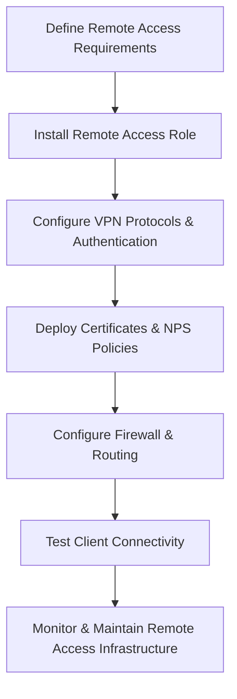

# Enterprise Windows Server Administration Knowledge Base  
## 22 — Remote Access and VPN Infrastructure (Windows Server 2019)

---

## Overview

Remote access infrastructure enables secure connectivity for remote users, branch offices, administrators, and hybrid workloads. Windows Server 2019 provides multiple remote access technologies including VPN (IKEv2, SSTP, L2TP/IPsec), DirectAccess, RADIUS/NPS, and Web Application Proxy.

This document covers:
- Remote access concepts  
- VPN protocols  
- Remote Access role installation  
- IKEv2 VPN deployment  
- SSTP VPN deployment  
- L2TP/IPsec configuration  
- RADIUS/NPS integration  
- DirectAccess overview  
- Web Application Proxy  
- Certificate requirements  
- Monitoring & troubleshooting  
- Best practices  

---

## 🧩 Workflow Diagram — Remote Access Deployment Lifecycle



---

# 1. Remote Access Concepts

Remote access provides:
- Secure connectivity  
- Encrypted communication  
- Identity-based access  
- Remote administration  
- Branch office connectivity  

Core technologies:
- VPN (IKEv2, SSTP, L2TP/IPsec)  
- DirectAccess  
- RADIUS/NPS  
- Web Application Proxy  

---

# 2. VPN Protocols

### IKEv2
- Modern  
- Fast  
- Supports mobility  
- Strong encryption  
- Recommended for enterprise

### SSTP
- Uses HTTPS (TCP 443)  
- Works behind firewalls  
- Ideal for remote workers

### L2TP/IPsec
- Legacy  
- Requires pre‑shared key or certificates  
- Still widely supported

---

# 3. Install Remote Access Role

### Install role

```powershell
Install-WindowsFeature RemoteAccess -IncludeManagementTools
```

### Install VPN component

```powershell
Install-WindowsFeature DirectAccess-VPN
```

### Open Remote Access console

```
Server Manager → Tools → Remote Access Management
```

---

# 4. IKEv2 VPN Deployment (Recommended)

## 4.1 Install certificate for VPN server

### Create certificate template (Web Server or custom VPN Server)

```powershell
certreq -submit vpnserver.req
```

### Bind certificate to VPN

```powershell
Set-VpnServerConfiguration -SslCertificateThumbprint <thumbprint>
```

## 4.2 Enable IKEv2

```powershell
Set-VpnServerConfiguration -TunnelType IKEv2
```

## 4.3 Configure IP address assignment

```powershell
Set-VpnServerConfiguration -IPAddressRange "10.20.20.1","10.20.20.200"
```

## 4.4 Configure authentication

```powershell
Set-VpnServerConfiguration -AuthenticationMethod EAP
```

---

# 5. SSTP VPN Deployment (HTTPS‑based)

## 5.1 Install SSL certificate

```powershell
certreq -submit sstp.req
```

## 5.2 Enable SSTP

```powershell
Set-VpnServerConfiguration -SslCertificateThumbprint <thumbprint> -TunnelType SSTP
```

## 5.3 Open firewall port

```powershell
New-NetFirewallRule -DisplayName "SSTP VPN" -Direction Inbound -Protocol TCP -LocalPort 443 -Action Allow
```

---

# 6. L2TP/IPsec VPN Deployment

## 6.1 Configure pre‑shared key

```powershell
Set-VpnServerConfiguration -L2tpPsk "CorpP@ssw0rd!"
```

## 6.2 Enable L2TP

```powershell
Set-VpnServerConfiguration -TunnelType L2TP
```

---

# 7. RADIUS / Network Policy Server (NPS)

NPS provides centralized authentication.

## 7.1 Install NPS

```powershell
Install-WindowsFeature NPAS -IncludeManagementTools
```

## 7.2 Register NPS in AD

```powershell
netsh ras add registeredserver
```

## 7.3 Add VPN server as RADIUS client

```powershell
New-NpsRadiusClient -Name "VPN01" -Address "192.168.10.10" -SharedSecret "CorpSecret123"
```

## 7.4 Create network policy

```powershell
New-NpsNetworkPolicy -Name "VPN Access" -UserGroup "Corp\VPNUsers"
```

---

# 8. DirectAccess (Enterprise Remote Access)

DirectAccess provides seamless remote connectivity without VPN.

### Install DirectAccess

```powershell
Install-WindowsFeature DirectAccess-VPN
```

### Configure DirectAccess wizard

```
Remote Access Management → DirectAccess Setup Wizard
```

### Requirements
- Windows 10 Enterprise  
- PKI  
- IPv6 or NAT64/DNS64  
- GPO integration  

---

# 9. Web Application Proxy (WAP)

WAP publishes internal applications securely.

### Install WAP

```powershell
Install-WindowsFeature Web-Application-Proxy -IncludeManagementTools
```

### Configure WAP

```powershell
Install-WebApplicationProxy -FederationServiceName "fs.corp.local" -CertificateThumbprint <thumbprint>
```

---

# 10. Certificate Requirements

### VPN Server Certificate
- Must include server FQDN  
- Must be trusted by clients  
- Must support server authentication  

### Client Certificates (optional)
- Used for EAP‑TLS  
- Issued via AD CS auto‑enrollment  

### CRL & AIA
- Must be reachable externally for SSTP/IKEv2  

---

# 11. Monitoring Remote Access

### View VPN connections

```powershell
Get-RemoteAccessConnectionStatistics
```

### View active sessions

```powershell
Get-RemoteAccessConnection
```

### View NPS logs

```powershell
Get-WinEvent -LogName "Security" | Where-Object {$_.Id -eq 6272}
```

---

# 12. Troubleshooting

| Issue | Cause | Fix |
|-------|-------|-----|
| VPN not connecting | Certificate mismatch | Reissue certificate |
| SSTP fails | Port 443 blocked | Open firewall |
| IKEv2 fails | NAT issues | Use NAT‑T |
| L2TP fails | Wrong PSK | Update PSK |
| NPS rejects login | Wrong policy | Fix network policy |
| DirectAccess fails | IPv6 issues | Check DNS64/NAT64 |

---

# 13. Best Practices

- Use IKEv2 for modern VPN deployments  
- Use SSTP for firewall‑restricted environments  
- Use RADIUS/NPS for centralized authentication  
- Use certificates for strong authentication  
- Use DirectAccess for seamless enterprise connectivity  
- Monitor VPN logs regularly  
- Document remote access architecture  
- Perform quarterly remote access audits  

---

# References

- Microsoft Learn — Remote Access  
- Microsoft Learn — VPN  
- Microsoft Learn — NPS  
- Microsoft Learn — DirectAccess  
- Microsoft Learn — Web Application Proxy  
```
