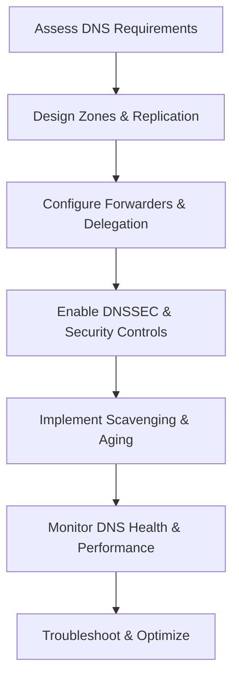

# Enterprise Windows Server Administration Knowledge Base  
## 23 — DNS Advanced Design and Troubleshooting (Windows Server 2019)

---

## Overview

DNS is one of the most critical components of Windows Server infrastructure. Active Directory, authentication, Group Policy, and nearly all enterprise services depend on reliable DNS resolution. Windows Server 2019 provides a robust DNS server with advanced features such as conditional forwarding, DNSSEC, scavenging, zone delegation, stub zones, and diagnostic tools.

This document covers:
- DNS architecture  
- Zone types  
- Advanced DNS design  
- Conditional forwarders  
- Stub zones  
- DNSSEC  
- Scavenging & aging  
- AD‑integrated DNS  
- Performance tuning  
- Diagnostic tools  
- Troubleshooting  
- Best practices  

---

## 🧩 Workflow Diagram — DNS Advanced Lifecycle



---

# 1. DNS Architecture

DNS provides:
- Name resolution  
- Service discovery  
- AD domain controller location  
- Kerberos authentication support  

Core components:
- Zones  
- Records  
- Forwarders  
- Replication  
- DNS clients  

---

# 2. DNS Zone Types

### Primary Zone
- Read/write  
- Stores zone data  

### Secondary Zone
- Read‑only  
- Replicates from primary  

### Stub Zone
- Contains NS records only  
- Used for delegation  

### AD‑Integrated Zone
- Stored in AD  
- Multi‑master replication  
- Recommended for enterprise  

---

# 3. Advanced DNS Design

### Recommended AD DNS Structure

```
corp.local
 ├── _msdcs.corp.local
 ├── corp.local (AD-integrated)
 ├── partner.local (conditional forwarder)
 └── child.corp.local (delegated zone)
```

### Multi‑site DNS design

- Use AD‑integrated zones  
- Use site‑aware DNS  
- Use local DCs for DNS queries  

### DNS replication scope

Options:
- Forest  
- Domain  
- Domain controllers only  

---

# 4. Conditional Forwarders

Conditional forwarders improve resolution for partner or external domains.

### Add conditional forwarder

```powershell
Add-DnsServerConditionalForwarderZone -Name "partner.local" -MasterServers 10.10.10.10
```

### View forwarders

```powershell
Get-DnsServerForwarder
```

---

# 5. Stub Zones

Stub zones maintain authoritative NS records for delegated domains.

### Create stub zone

```powershell
Add-DnsServerStubZone -Name "child.corp.local" -MasterServers 192.168.50.10
```

### View stub zone

```powershell
Get-DnsServerZone
```

---

# 6. DNSSEC (Security Enhancements)

DNSSEC protects against:
- Spoofing  
- Cache poisoning  
- Tampering  

### Enable DNSSEC

```powershell
Add-DnsServerSigningKey -ZoneName "corp.local"
Invoke-DnsServerZoneSign -ZoneName "corp.local"
```

### Validate DNSSEC

```powershell
Resolve-DnsName corp.local -DnssecOk
```

---

# 7. Scavenging & Aging

Scavenging removes stale DNS records.

### Enable scavenging

```powershell
Set-DnsServerScavenging -ScavengingState $true -RefreshInterval 7.00:00:00 -NoRefreshInterval 7.00:00:00
```

### Enable scavenging on zone

```powershell
Set-DnsServerZoneAging -Name "corp.local" -Aging $true
```

### Start scavenging manually

```powershell
Invoke-DnsServerScavenging
```

---

# 8. AD‑Integrated DNS

### Convert zone to AD‑integrated

```powershell
Set-DnsServerPrimaryZone -Name "corp.local" -ReplicationScope "Domain"
```

### View replication scope

```powershell
Get-DnsServerZone -Name "corp.local"
```

---

# 9. DNS Performance Tuning

### Increase cache size

```powershell
Set-DnsServerCache -MaxKBSize 20480
```

### Enable recursion (default)

```powershell
Set-DnsServerRecursion -Enable $true
```

### Disable recursion (security)

```powershell
Set-DnsServerRecursion -Enable $false
```

### Enable round‑robin

```powershell
Set-DnsServerRoundRobin -Enable $true
```

---

# 10. DNS Diagnostic Tools

### Test DNS resolution

```powershell
Resolve-DnsName corp.local
```

### Test SRV records (AD critical)

```powershell
nslookup -type=SRV _ldap._tcp.dc._msdcs.corp.local
```

### Test DNS server health

```powershell
dcdiag /test:dns
```

### View DNS logs

```powershell
Get-WinEvent -LogName "DNS Server"
```

---

# 11. Troubleshooting

| Issue | Cause | Fix |
|-------|-------|-----|
| AD not working | Missing SRV records | Re-register DC records |
| Slow logons | DNS misconfigured | Point clients to DC DNS |
| Name not resolving | Stale record | Enable scavenging |
| Conditional forwarder fails | Wrong IP | Update master servers |
| DNSSEC errors | Key expired | Re-sign zone |
| Duplicate records | DHCP conflict | Enable DHCP conflict detection |

### Re-register DNS records

```powershell
ipconfig /registerdns
```

### Flush DNS cache

```powershell
Clear-DnsClientCache
```

---

# 12. Best Practices

- Use AD‑integrated zones  
- Use conditional forwarders for partner domains  
- Use stub zones for delegated domains  
- Enable scavenging to remove stale records  
- Use DNSSEC for enhanced security  
- Ensure clients use only internal DNS  
- Monitor DNS logs regularly  
- Document DNS architecture  
- Perform quarterly DNS audits  

---

# References

- Microsoft Learn — DNS Server  
- Microsoft Learn — DNSSEC  
- Microsoft Learn — Conditional Forwarders  
- Microsoft Learn — Troubleshooting DNS  
```
