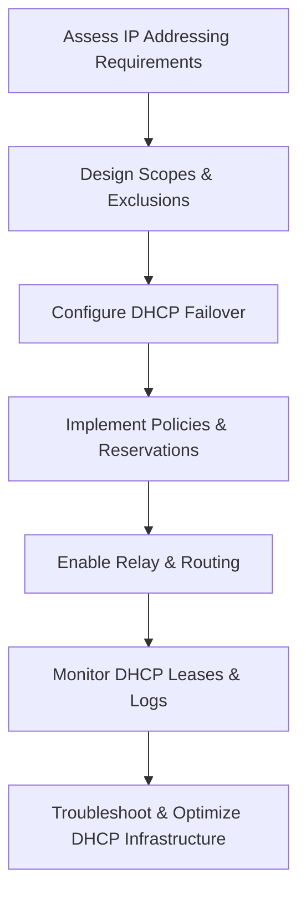

# Enterprise Windows Server Administration Knowledge Base  
## 24 — DHCP Advanced Design and Troubleshooting (Windows Server 2019)

---

## Overview

Dynamic Host Configuration Protocol (DHCP) is essential for automated IP address assignment, network configuration, and device onboarding. Windows Server 2019 includes a robust DHCP server with advanced features such as failover clustering, DHCP policies, MAC filtering, DHCP relay, IP address management (IPAM) integration, and auditing.

This document covers:
- DHCP architecture  
- Scope design  
- DHCP failover  
- DHCP policies  
- DHCP reservations  
- DHCP relay (IP helper)  
- DHCP auditing  
- IPAM integration  
- Advanced configuration  
- Diagnostics  
- Troubleshooting  
- Best practices  

---

## 🧩 Workflow Diagram — DHCP Advanced Lifecycle



---

# 1. DHCP Architecture

DHCP provides:
- Automatic IP assignment  
- DNS registration  
- Gateway & subnet configuration  
- Option delivery (e.g., PXE, SIP, VoIP)  

Core components:
- Scopes  
- Reservations  
- Options  
- Policies  
- Failover  
- Relay agents  

---

# 2. Scope Design

### Recommended Scope Structure

```
Subnet: 192.168.10.0/24
 ├── Scope: 192.168.10.50–192.168.10.200
 ├── Exclusions: 192.168.10.1–49 (static devices)
 ├── Reservations: Servers, printers, appliances
 └── Options:
       - Router: 192.168.10.1
       - DNS: 192.168.10.10, 192.168.10.11
       - Domain: corp.local
```

### Create DHCP scope

```powershell
Add-DhcpServerv4Scope -Name "CorpLAN" -StartRange 192.168.10.50 -EndRange 192.168.10.200 -SubnetMask 255.255.255.0
```

### Add exclusion range

```powershell
Add-DhcpServerv4ExclusionRange -ScopeId 192.168.10.0 -StartRange 192.168.10.1 -EndRange 192.168.10.49
```

---

# 3. DHCP Failover (High Availability)

DHCP failover provides:
- Redundancy  
- Load balancing  
- Hot standby  

### Configure failover (load balancing)

```powershell
Add-DhcpServerv4Failover -Name "CorpFailover" -PartnerServer "SRV-DHCP02" -ScopeId 192.168.10.0 -LoadBalancePercent 50
```

### Configure failover (hot standby)

```powershell
Add-DhcpServerv4Failover -Name "CorpStandby" -PartnerServer "SRV-DHCP02" -ScopeId 192.168.10.0 -Mode HotStandby
```

### View failover status

```powershell
Get-DhcpServerv4Failover
```

---

# 4. DHCP Policies (Advanced Filtering)

Policies allow conditional IP assignment based on:
- MAC address  
- Vendor class  
- User class  
- Relay agent  
- Client ID  

### Create policy for VoIP phones

```powershell
Add-DhcpServerv4Policy -Name "VoIP" -ScopeId 192.168.10.0 -VendorClass EQ "Cisco-VoIP"
```

### Assign options to policy

```powershell
Set-DhcpServerv4OptionValue -PolicyName "VoIP" -ScopeId 192.168.10.0 -OptionId 66 -Value "tftp.corp.local"
```

---

# 5. DHCP Reservations

### Create reservation

```powershell
Add-DhcpServerv4Reservation -ScopeId 192.168.10.0 -IPAddress 192.168.10.20 -ClientId "00-11-22-33-44-55" -Description "Printer01"
```

### View reservations

```powershell
Get-DhcpServerv4Reservation -ScopeId 192.168.10.0
```

---

# 6. DHCP Relay (IP Helper)

DHCP relay forwards DHCP requests across subnets.

### Configure IP helper on router

```powershell
netsh interface ipv4 add dhcpserver 192.168.10.10
```

### Verify relay

```powershell
Get-NetIPInterface
```

---

# 7. DHCP Options

### Set global options

```powershell
Set-DhcpServerv4OptionValue -OptionId 6 -Value 192.168.10.10,192.168.10.11
```

### Set scope options

```powershell
Set-DhcpServerv4OptionValue -ScopeId 192.168.10.0 -OptionId 3 -Value 192.168.10.1
```

### Common options

| Option | Purpose |
|--------|----------|
| 3 | Router (gateway) |
| 6 | DNS servers |
| 15 | DNS domain |
| 66 | TFTP server |
| 67 | Boot file name |
| 42 | NTP servers |

---

# 8. DHCP Auditing

DHCP logs are stored at:

```
C:\Windows\System32\dhcp
```

### Enable auditing

```powershell
Set-DhcpServerAuditLog -Enable $true
```

### View audit logs

```powershell
Get-Content "C:\Windows\System32\dhcp\DhcpSrvLog-*.log"
```

---

# 9. IPAM Integration

IPAM provides:
- IP tracking  
- DHCP management  
- DNS integration  
- Utilization reports  

### Install IPAM

```powershell
Install-WindowsFeature IPAM -IncludeManagementTools
```

### Start IPAM discovery

```powershell
Start-IpamDiscovery
```

---

# 10. Diagnostics

### View active leases

```powershell
Get-DhcpServerv4Lease -ScopeId 192.168.10.0
```

### Test DHCP server

```powershell
Test-DhcpServer -IPAddress 192.168.10.10
```

### Check scope utilization

```powershell
Get-DhcpServerv4ScopeStatistics
```

### Renew client IP

```powershell
ipconfig /renew
```

---

# 11. Troubleshooting

| Issue | Cause | Fix |
|-------|-------|-----|
| Clients not receiving IP | Relay missing | Configure IP helper |
| Duplicate IPs | No conflict detection | Enable conflict detection |
| Wrong DNS servers | Incorrect option | Update option 6 |
| DHCP failover broken | Time skew | Sync NTP |
| Scope full | Exhausted range | Expand scope |
| PXE boot fails | Wrong option 67 | Correct boot file name |

### Enable conflict detection

```powershell
Set-DhcpServerv4Binding -ConflictDetectionAttempts 2
```

### Reconcile scope

```powershell
Invoke-DhcpServerv4Reconcile -ScopeId 192.168.10.0
```

---

# 12. Best Practices

- Use DHCP failover for high availability  
- Use AD‑integrated DNS with DHCP  
- Use reservations for servers & printers  
- Use policies for VoIP & special devices  
- Enable auditing for compliance  
- Use IPAM for IP governance  
- Document scope design  
- Perform quarterly DHCP audits  

---

# References

- Microsoft Learn — DHCP  
- Microsoft Learn — DHCP Failover  
- Microsoft Learn — IPAM  
- Microsoft Learn — DHCP Troubleshooting  
```
