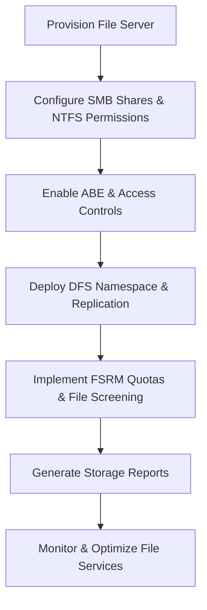

# Enterprise Windows Server Administration Knowledge Base  
## 25 — File Services and FSRM (Advanced) (Windows Server 2019)

---

## Overview

Windows Server 2019 provides a powerful suite of file services for enterprise environments, including SMB file sharing, DFS Namespaces, DFS Replication, NTFS permissions, Access‑Based Enumeration (ABE), and File Server Resource Manager (FSRM). These tools enable secure, scalable, and policy‑driven file storage with advanced quota management, file screening, reporting, and automated classification.

This document covers:
- File Services architecture  
- SMB configuration  
- NTFS permissions  
- Access‑Based Enumeration  
- DFS Namespaces  
- DFS Replication  
- FSRM installation  
- Quotas  
- File screening  
- File classification  
- Storage reporting  
- Automation  
- Troubleshooting  
- Best practices  

---

## 🧩 Workflow Diagram — File Services & FSRM Lifecycle



---

# 1. File Services Architecture

File Services provide:
- Centralized file storage  
- Secure access control  
- High availability  
- Replication  
- Quotas & screening  
- Storage reporting  

Core components:
- SMB shares  
- NTFS permissions  
- DFS Namespaces  
- DFS Replication  
- FSRM (Quotas, Screening, Classification)  

---

# 2. SMB File Sharing

### Create SMB share

```powershell
New-SmbShare -Name "CorpData" -Path "D:\CorpData" -FullAccess "Corp\Admins" -ReadAccess "Corp\Users"
```

### Enable SMB encryption

```powershell
Set-SmbShare -Name "CorpData" -EncryptData $true
```

### Enable continuous availability (for clustered file servers)

```powershell
Set-SmbShare -Name "CorpData" -ContinuouslyAvailable $true
```

---

# 3. NTFS Permissions (Advanced)

### View permissions

```powershell
Get-Acl "D:\CorpData"
```

### Set permissions

```powershell
$acl = Get-Acl "D:\CorpData"
$rule = New-Object System.Security.AccessControl.FileSystemAccessRule("Corp\Users","Read","ContainerInherit,ObjectInherit","None","Allow")
$acl.AddAccessRule($rule)
Set-Acl "D:\CorpData" $acl
```

### Recommended NTFS model

```
Folder: D:\CorpData
 ├── HR (HR-Users: Modify)
 ├── Finance (Finance-Users: Modify)
 ├── IT (IT-Admins: Full Control)
 └── Public (Everyone: Read)
```

---

# 4. Access‑Based Enumeration (ABE)

ABE hides files/folders users do not have permission to access.

### Enable ABE

```powershell
Set-SmbShare -Name "CorpData" -FolderEnumerationMode AccessBased
```

---

# 5. DFS Namespaces (DFS‑N)

DFS‑N provides a unified folder structure across servers.

### Install DFS Namespace

```powershell
Install-WindowsFeature FS-DFS-Namespace
```

### Create namespace

```powershell
New-DfsnRoot -Path "\\corp.local\CorpDFS" -TargetPath "\\SRV-FS01\CorpData" -Type DomainV2
```

### Add folder to namespace

```powershell
New-DfsnFolder -Path "\\corp.local\CorpDFS\HR" -TargetPath "\\SRV-FS01\HR"
```

---

# 6. DFS Replication (DFS‑R)

DFS‑R provides multi‑site replication.

### Install DFS Replication

```powershell
Install-WindowsFeature FS-DFS-Replication
```

### Create replication group

```powershell
New-DfsReplicationGroup -GroupName "CorpDataRG"
```

### Add members

```powershell
Add-DfsrMember -GroupName "CorpDataRG" -ComputerName "SRV-FS01"
Add-DfsrMember -GroupName "CorpDataRG" -ComputerName "SRV-FS02"
```

### Add replicated folder

```powershell
New-DfsReplicatedFolder -GroupName "CorpDataRG" -FolderName "CorpData"
```

### Set replication topology

```powershell
Set-DfsrGroupSchedule -GroupName "CorpDataRG" -ScheduleType Full
```

---

# 7. Install FSRM

```powershell
Install-WindowsFeature FS-Resource-Manager -IncludeManagementTools
```

Launch:

```
Server Manager → Tools → File Server Resource Manager
```

---

# 8. FSRM Quotas

### Create quota template

```powershell
New-FsrmQuotaTemplate -Name "100GBQuota" -Size 100GB
```

### Apply quota

```powershell
New-FsrmQuota -Path "D:\CorpData\HR" -Template "100GBQuota"
```

### View quotas

```powershell
Get-FsrmQuota
```

---

# 9. File Screening

### Create file screen template (block video files)

```powershell
New-FsrmFileScreenTemplate -Name "BlockVideo" -IncludeGroup "Video Files"
```

### Apply file screen

```powershell
New-FsrmFileScreen -Path "D:\CorpData\Public" -Template "BlockVideo"
```

### View file screens

```powershell
Get-FsrmFileScreen
```

---

# 10. File Classification

### Create classification rule

```powershell
New-FsrmClassificationRule -Name "ConfidentialRule" -Property "Confidential" -MatchType Contains -MatchValue "Confidential"
```

### Apply classification

```powershell
Start-FsrmClassification
```

---

# 11. Storage Reporting

### Generate report

```powershell
New-FsrmStorageReport -ReportType LargeFiles -Path "D:\CorpData" -Format Html -ReportName "LargeFilesReport"
```

### View report

```powershell
Get-FsrmStorageReport
```

---

# 12. Automation

### Automated cleanup script

```powershell
Get-ChildItem "D:\CorpData\Temp" -Recurse | Remove-Item -Force
```

### Automated quota monitoring

```powershell
Get-FsrmQuota | Where-Object {$_.Usage > ($_.Size * 0.9)}
```

---

# 13. Troubleshooting

| Issue | Cause | Fix |
|-------|-------|-----|
| DFS‑R not replicating | Staging full | Increase staging size |
| ABE not working | NTFS misconfigured | Fix permissions |
| Quotas not applying | Wrong template | Reapply template |
| File screening ignored | Incorrect path | Apply to correct folder |
| Slow SMB access | NIC issues | Enable RSS & SMB multichannel |

### Restart DFS‑R

```powershell
Restart-Service DFSR
```

---

# 14. Best Practices

- Use NTFS permissions for security  
- Use SMB encryption for sensitive data  
- Use ABE to hide restricted folders  
- Use DFS‑N for unified access  
- Use DFS‑R for multi‑site replication  
- Use FSRM quotas to control storage  
- Use file screening to block unwanted files  
- Document file server architecture  
- Perform quarterly storage audits  

---

# References

- Microsoft Learn — File Services  
- Microsoft Learn — FSRM  
- Microsoft Learn — DFS Replication  
- Microsoft Learn — SMB  
```
