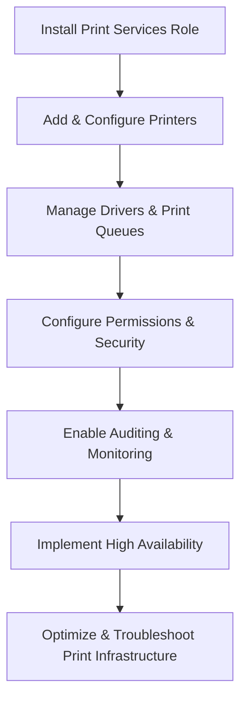

# Enterprise Windows Server Administration Knowledge Base  
## 26 — Print Services and Enterprise Printing (Windows Server 2019)

---

## Overview

Windows Server 2019 provides centralized print management through the Print and Document Services role. Enterprise printing requires secure, scalable, and manageable infrastructure that supports shared printers, driver management, print queues, auditing, quotas, and high availability. This document covers advanced print server deployment, configuration, optimization, and troubleshooting.

Topics include:
- Print Services architecture  
- Print server installation  
- Printer sharing  
- Driver management  
- Print queues  
- Print permissions  
- Print server clustering  
- Print auditing  
- Print management automation  
- Troubleshooting  
- Best practices  

---

## 🧩 Workflow Diagram — Enterprise Print Services Lifecycle



---

# 1. Print Services Architecture

Print Services provide:
- Centralized printer management  
- Driver distribution  
- Print queue control  
- Access control  
- Auditing & monitoring  

Core components:
- Print Server role  
- Print Management console  
- Printer drivers  
- Print queues  
- Printer ports  
- Print server clustering  

---

# 2. Install Print and Document Services

### Install role

```powershell
Install-WindowsFeature Print-Server -IncludeManagementTools
```

### Launch Print Management

```
Server Manager → Tools → Print Management
```

---

# 3. Add and Configure Printers

## 3.1 Create TCP/IP printer port

```powershell
Add-PrinterPort -Name "IP_192.168.20.50" -PrinterHostAddress "192.168.20.50"
```

## 3.2 Install printer driver

```powershell
Add-PrinterDriver -Name "HP Universal Printing PCL 6"
```

## 3.3 Add printer

```powershell
Add-Printer -Name "Corp-Printer01" -DriverName "HP Universal Printing PCL 6" -PortName "IP_192.168.20.50"
```

---

# 4. Printer Sharing

### Share printer

```powershell
Set-Printer -Name "Corp-Printer01" -Shared $true -ShareName "CorpPrinter01"
```

### Set printer location (useful for large enterprises)

```powershell
Set-Printer -Name "Corp-Printer01" -Location "Level 3 - Finance"
```

### Set printer comment

```powershell
Set-Printer -Name "Corp-Printer01" -Comment "Finance Department Printer"
```

---

# 5. Driver Management

### View installed drivers

```powershell
Get-PrinterDriver
```

### Remove driver

```powershell
Remove-PrinterDriver -Name "OldDriver"
```

### Recommended driver strategy

- Use **Type 4 drivers** when possible  
- Use **Universal Print Drivers (UPD)** for compatibility  
- Avoid mixing PCL and PS drivers on the same printer  

---

# 6. Print Queue Management

### View print queue

```powershell
Get-PrintJob -PrinterName "Corp-Printer01"
```

### Remove print job

```powershell
Remove-PrintJob -PrinterName "Corp-Printer01" -ID 3
```

### Pause printer

```powershell
Suspend-Printer -Name "Corp-Printer01"
```

### Resume printer

```powershell
Resume-Printer -Name "Corp-Printer01"
```

---

# 7. Printer Permissions & Security

### View permissions

```powershell
(Get-Printer -Name "Corp-Printer01").PermissionSDDL
```

### Set permissions (example: allow Finance group to print)

```powershell
$acl = Get-Acl "PrintServer::Corp-Printer01"
$rule = New-Object System.Security.AccessControl.FileSystemAccessRule("Corp\Finance-Users","Print","Allow")
$acl.AddAccessRule($rule)
Set-Acl "PrintServer::Corp-Printer01" $acl
```

### Recommended permission model

```
Corp-Printer01
 ├── Corp\Admins (Manage Printers)
 ├── Corp\Finance-Users (Print)
 └── Everyone (None)
```

---

# 8. Print Server Clustering (High Availability)

### Install Failover Clustering

```powershell
Install-WindowsFeature Failover-Clustering -IncludeManagementTools
```

### Create cluster

```powershell
New-Cluster -Name "PrintCluster" -Node SRV-PRINT01, SRV-PRINT02 -StaticAddress 192.168.20.100
```

### Add Print Server role

```
Failover Cluster Manager → Roles → Configure Role → Print Server
```

### Benefits
- High availability  
- Automatic failover  
- Shared print queues  

---

# 9. Print Auditing

### Enable auditing via GPO

```
Computer Configuration → Policies → Windows Settings → Security Settings → Advanced Audit Policy → Object Access → Audit File System
```

### View print logs

```powershell
Get-WinEvent -LogName "Microsoft-Windows-PrintService/Operational"
```

### Common audit events

| Event ID | Description |
|----------|-------------|
| 307 | Document printed |
| 805 | Printer added |
| 812 | Printer deleted |

---

# 10. Print Management Automation

### Export printer configuration

```powershell
Export-Printer -Name "Corp-Printer01" -FilePath "C:\Backup\CorpPrinter01.printerExport"
```

### Import printer configuration

```powershell
Import-Printer -FilePath "C:\Backup\CorpPrinter01.printerExport"
```

### Deploy printers via GPO

```
User Configuration → Preferences → Control Panel Settings → Printers
```

---

# 11. Troubleshooting

| Issue | Cause | Fix |
|-------|-------|-----|
| Print jobs stuck | Corrupt queue | Restart spooler |
| Printer offline | Port unreachable | Check network |
| Driver issues | Wrong driver | Use UPD |
| Slow printing | Large spool files | Enable direct printing |
| Users cannot print | Permission issue | Fix ACLs |
| Cluster not failing over | Resource error | Validate cluster |

### Restart print spooler

```powershell
Restart-Service spooler
```

### Clear print queue manually

```powershell
Remove-Item "C:\Windows\System32\spool\PRINTERS\*" -Force
```

---

# 12. Best Practices

- Use universal drivers  
- Use Type 4 drivers when possible  
- Use print server clustering for HA  
- Use GPO for printer deployment  
- Use ABE for secure printer visibility  
- Audit printing for compliance  
- Document printer locations & permissions  
- Perform quarterly print server maintenance  

---

# References

- Microsoft Learn — Print Services  
- Microsoft Learn — FSRM  
- Microsoft Learn — Print Server Clustering  
- Microsoft Learn — Printer Management  
```
