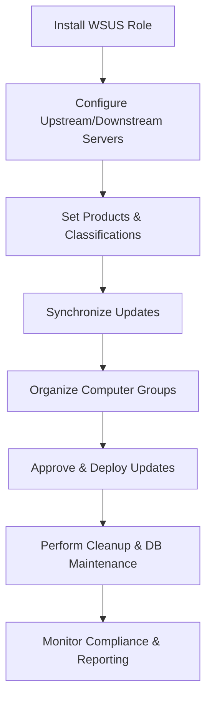

# Enterprise Windows Server Administration Knowledge Base  
## 27 — WSUS Advanced Administration (Windows Server 2019)

---

## Overview

Windows Server Update Services (WSUS) provides centralized patch management for Windows Server and Windows client environments. Advanced WSUS administration ensures reliable update distribution, optimized synchronization, secure configuration, and integration with enterprise automation systems. Windows Server 2019 includes improvements in performance, security, and Windows 10/11 servicing support.

This document covers:
- WSUS architecture  
- Installation & configuration  
- Upstream/downstream server design  
- Synchronization & classifications  
- Computer groups & targeting  
- Update approvals  
- WSUS cleanup & optimization  
- WSUS database maintenance  
- Reporting  
- PowerShell automation  
- Troubleshooting  
- Best practices  

---

## 🧩 Workflow Diagram — WSUS Advanced Lifecycle



---

# 1. WSUS Architecture

WSUS provides:
- Centralized update management  
- Controlled patch deployment  
- Reporting & compliance  
- Bandwidth optimization  

### Deployment Models

#### Standalone WSUS
- Single server  
- Suitable for small environments  

#### Upstream/Downstream WSUS
- Upstream syncs from Microsoft  
- Downstream syncs from upstream  
- Suitable for multi‑site enterprises  

#### Replica Mode
- Downstream server mirrors approvals  
- Centralized control  

---

# 2. Install WSUS

### Install WSUS role

```powershell
Install-WindowsFeature -Name UpdateServices -IncludeManagementTools
```

### Configure WSUS database (WID)

```powershell
Invoke-WsusServerConfiguration -SqlInstanceName "WID"
```

### Configure WSUS content directory

```powershell
Set-WsusServerSynchronization -ContentDirectory "D:\WSUS"
```

---

# 3. Configure Upstream/Downstream Servers

### Set upstream server

```powershell
Set-WsusServerSynchronization -SyncFromMicrosoftUpdate $false
Set-WsusServerSynchronization -UpstreamServerName "WSUS-UPSTREAM" -PortNumber 8530
```

### Configure replica mode

```powershell
Set-WsusServer -Replica $true
```

---

# 4. Products & Classifications

### Set products

```powershell
Get-WsusProduct | Where-Object {$_.Product.Title -like "*Windows Server 2019*"} | Set-WsusProduct
```

### Set classifications

```powershell
Get-WsusClassification | Where-Object {$_.Classification.Title -in @("Security Updates","Critical Updates")} | Set-WsusClassification
```

---

# 5. Synchronization

### Start sync

```powershell
Start-WsusServerSynchronization
```

### View sync status

```powershell
Get-WsusServerSynchronization
```

### Schedule sync

```powershell
Set-WsusServerSynchronizationSchedule -SyncTime "03:00" -SyncInterval 24
```

---

# 6. Computer Groups & Targeting

### Create computer group

```powershell
Add-WsusComputerTargetGroup -Name "Production Servers"
```

### Move computer to group

```powershell
$group = Get-WsusComputerTargetGroup -Name "Production Servers"
$computer = Get-WsusComputer | Where-Object {$_.FullDomainName -eq "SRV-APP01.corp.local"}
$group.AddComputerTarget($computer)
```

### Client‑side targeting (GPO)

```
Computer Configuration → Policies → Administrative Templates → Windows Components → Windows Update → Enable client-side targeting
```

---

# 7. Update Approvals

### Approve update

```powershell
$update = Get-WsusUpdate | Where-Object {$_.Title -like "*KB5030211*"}
$group = Get-WsusComputerTargetGroup -Name "Production Servers"
$update.Approve("Install",$group)
```

### Decline update

```powershell
$update.Decline()
```

### View approval status

```powershell
Get-WsusUpdate | Select Title,UpdateState
```

---

# 8. WSUS Cleanup & Optimization

### Run WSUS cleanup

```powershell
Invoke-WsusServerCleanup -CleanupObsoleteUpdates -CleanupObsoleteComputers -CompressUpdates -DeclineExpiredUpdates -DeclineSupersededUpdates
```

### Remove obsolete computers

```powershell
Invoke-WsusServerCleanup -CleanupObsoleteComputers
```

### Decline superseded updates

```powershell
Invoke-WsusServerCleanup -DeclineSupersededUpdates
```

---

# 9. WSUS Database Maintenance

### Reindex WSUS database (WID)

```powershell
& "$env:ProgramFiles\Update Services\Database\Sql\WsusDBMaintenance.sql"
```

### Shrink database (SQL Server)

```sql
DBCC SHRINKDATABASE ('SUSDB');
```

### Check database health

```sql
DBCC CHECKDB ('SUSDB');
```

---

# 10. Reporting

### Generate update status report

```powershell
Get-WsusUpdate | Select Title,UpdateState | Export-Csv "C:\Reports\WSUS-UpdateStatus.csv"
```

### Generate computer compliance report

```powershell
Get-WsusComputer | Select FullDomainName,LastSyncTime | Export-Csv "C:\Reports\WSUS-Compliance.csv"
```

---

# 11. PowerShell Automation

### Approve all security updates

```powershell
Get-WsusUpdate | Where-Object {$_.Classification.Title -eq "Security Updates"} | ForEach-Object {
    $_.Approve("Install",(Get-WsusComputerTargetGroup -Name "Production Servers"))
}
```

### Decline all superseded updates

```powershell
Get-WsusUpdate | Where-Object {$_.IsSuperseded} | ForEach-Object { $_.Decline() }
```

---

# 12. Troubleshooting

| Issue | Cause | Fix |
|-------|-------|-----|
| Clients not reporting | Wrong WSUS URL | Fix GPO |
| Sync fails | Proxy issues | Configure proxy |
| DB slow | Fragmentation | Reindex SUSDB |
| Updates not installing | Approval missing | Approve updates |
| WSUS console slow | Too many updates | Run cleanup |
| Downstream not syncing | Upstream unreachable | Check firewall |

### Reset WSUS client

```powershell
wuauclt /resetauthorization /detectnow
```

### Check client WSUS settings

```powershell
Get-WindowsUpdateLog
```

---

# 13. Best Practices

- Use upstream/downstream architecture for large environments  
- Use replica mode for centralized control  
- Approve only required classifications  
- Run WSUS cleanup monthly  
- Reindex SUSDB quarterly  
- Use GPO for client targeting  
- Document WSUS architecture  
- Monitor update compliance regularly  

---

# References

- Microsoft Learn — WSUS  
- Microsoft Learn — Windows Update  
- Microsoft Learn — Patch Management  
```
