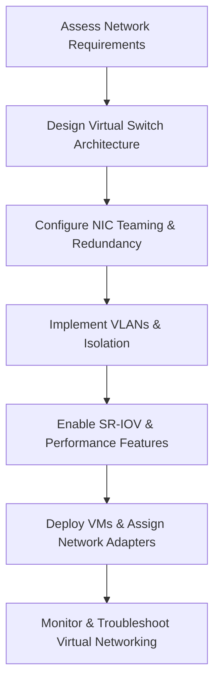

# Enterprise Windows Server Administration Knowledge Base  
## 28 — Hyper‑V Networking and Virtual Switch Design (Windows Server 2019)

---

## Overview

Hyper‑V networking is a foundational component of virtualized infrastructure. Windows Server 2019 provides a powerful virtual networking stack that supports virtual switches, VLANs, NIC teaming, SR‑IOV, bandwidth management, isolation, and integration with physical networks. Proper design ensures high availability, performance, security, and scalability.

This document covers:
- Hyper‑V networking concepts  
- Virtual switch types  
- NIC teaming  
- VLAN tagging  
- SR‑IOV  
- Bandwidth management  
- VMQ & vRSS  
- Network isolation  
- Advanced switch configuration  
- Troubleshooting  
- Best practices  

---

## 🧩 Workflow Diagram — Hyper‑V Networking Lifecycle



---

# 1. Hyper‑V Networking Concepts

Hyper‑V networking provides:
- Virtual network segmentation  
- High‑performance VM connectivity  
- Redundant network paths  
- Integration with physical networks  
- Security isolation  

Core components:
- Virtual switches  
- Virtual network adapters  
- NIC teaming  
- VLANs  
- SR‑IOV  
- VMQ/vRSS  

---

# 2. Virtual Switch Types

### External Virtual Switch
- Connects VMs to physical network  
- Most common in production  
- Supports teaming, VLANs, SR‑IOV  

### Internal Virtual Switch
- Connects VMs to host only  
- No physical network access  

### Private Virtual Switch
- Connects VMs to each other only  
- No host or physical network access  

---

# 3. Create Virtual Switches

### Create external switch

```powershell
New-VMSwitch -Name "ProdSwitch" -NetAdapterName "Ethernet1" -AllowManagementOS $true
```

### Create internal switch

```powershell
New-VMSwitch -Name "InternalSwitch" -SwitchType Internal
```

### Create private switch

```powershell
New-VMSwitch -Name "PrivateSwitch" -SwitchType Private
```

---

# 4. NIC Teaming (Load Balancing & Failover)

NIC teaming provides:
- Redundancy  
- Load balancing  
- Increased throughput  

### Create NIC team

```powershell
New-NetLbfoTeam -Name "HyperVTeam" -TeamMembers "Ethernet1","Ethernet2" -TeamingMode SwitchIndependent -LoadBalancingAlgorithm Dynamic
```

### Bind virtual switch to NIC team

```powershell
New-VMSwitch -Name "TeamSwitch" -NetAdapterName "HyperVTeam"
```

---

# 5. VLAN Tagging

### Assign VLAN to VM NIC

```powershell
Set-VMNetworkAdapterVlan -VMName "SRV-APP01" -Access -VlanId 30
```

### Assign trunk mode (for virtual appliances)

```powershell
Set-VMNetworkAdapterVlan -VMName "SRV-FW01" -Trunk -AllowedVlanIdList "10,20,30" -NativeVlanId 1
```

---

# 6. SR‑IOV (High‑Performance Networking)

SR‑IOV bypasses the virtual switch for near‑native performance.

### Enable SR‑IOV on virtual switch

```powershell
Set-VMSwitch -Name "ProdSwitch" -EnableIov $true
```

### Enable SR‑IOV on VM NIC

```powershell
Set-VMNetworkAdapter -VMName "SRV-DB01" -IovWeight 100
```

---

# 7. Bandwidth Management

### Set minimum bandwidth

```powershell
Set-VMNetworkAdapter -VMName "SRV-APP01" -MinimumBandwidthWeight 50
```

### Set maximum bandwidth

```powershell
Set-VMNetworkAdapter -VMName "SRV-APP01" -MaximumBandwidth 100Mbps
```

---

# 8. VMQ & vRSS (Performance Optimization)

### Enable VMQ

```powershell
Set-NetAdapterVmq -Name "Ethernet1" -Enabled $true
```

### Enable vRSS

```powershell
Set-VMNetworkAdapter -VMName "SRV-APP01" -VrssEnabled $true
```

---

# 9. Network Isolation

### Private VLANs (PVLANs)

Used for multi‑tenant isolation.

### Hyper‑V isolation options
- Private virtual switches  
- VLAN segmentation  
- PVLANs (via physical switch)  
- Network virtualization (NVGRE)  

---

# 10. Advanced Switch Configuration

### Enable DHCP Guard

```powershell
Set-VMNetworkAdapter -VMName "SRV-APP01" -DhcpGuard On
```

### Enable Router Guard

```powershell
Set-VMNetworkAdapter -VMName "SRV-APP01" -RouterGuard On
```

### Enable Port Mirroring

```powershell
Set-VMNetworkAdapter -VMName "SRV-APP01" -PortMirroring Source
Set-VMNetworkAdapter -VMName "SRV-MON01" -PortMirroring Destination
```

### Enable MAC spoofing (required for nested virtualization)

```powershell
Set-VMNetworkAdapter -VMName "SRV-HYP01" -MacAddressSpoofing On
```

---

# 11. Monitoring Hyper‑V Networking

### View virtual switch configuration

```powershell
Get-VMSwitch
```

### View VM NIC configuration

```powershell
Get-VMNetworkAdapter -VMName "SRV-APP01"
```

### Monitor bandwidth usage

```powershell
Get-Counter '\Hyper-V Virtual Network Adapter(*)\Bytes/sec'
```

---

# 12. Troubleshooting

| Issue | Cause | Fix |
|-------|-------|-----|
| VM cannot reach network | Wrong VLAN | Correct VLAN ID |
| Slow VM network | VMQ disabled | Enable VMQ/vRSS |
| SR‑IOV not working | NIC unsupported | Check hardware |
| NIC team down | Adapter failure | Replace NIC |
| Switch not binding | Team misconfigured | Recreate team |
| No DHCP | DHCP Guard enabled | Disable DHCP Guard |

### Reset virtual switch

```powershell
Remove-VMSwitch -Name "ProdSwitch"
New-VMSwitch -Name "ProdSwitch" -NetAdapterName "Ethernet1"
```

---

# 13. Best Practices

- Use NIC teaming for redundancy  
- Use external switches for production workloads  
- Use VLANs for segmentation  
- Use SR‑IOV for high‑performance workloads  
- Enable VMQ/vRSS for performance  
- Use DHCP/Router Guard for security  
- Document virtual switch architecture  
- Monitor virtual network performance  
- Perform quarterly Hyper‑V network audits  

---

# References

- Microsoft Learn — Hyper‑V Networking  
- Microsoft Learn — Virtual Switch  
- Microsoft Learn — NIC Teaming  
- Microsoft Learn — SR‑IOV  
```
